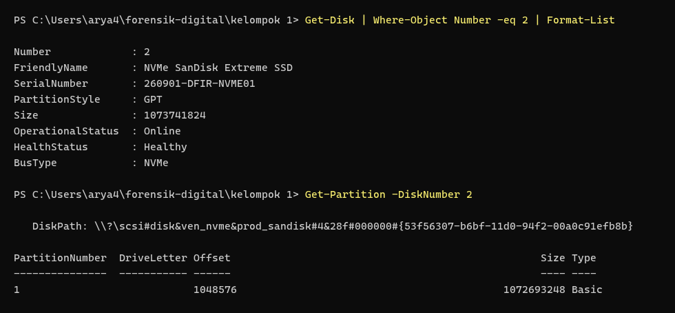
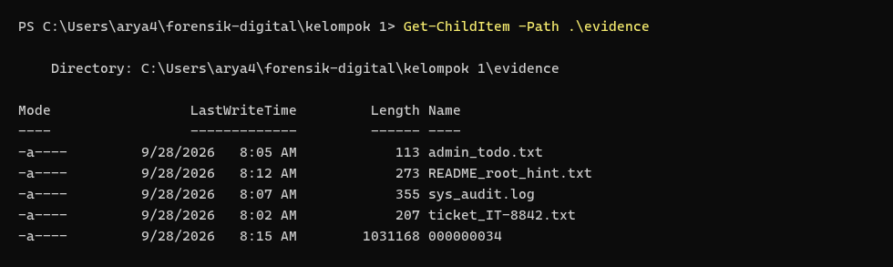
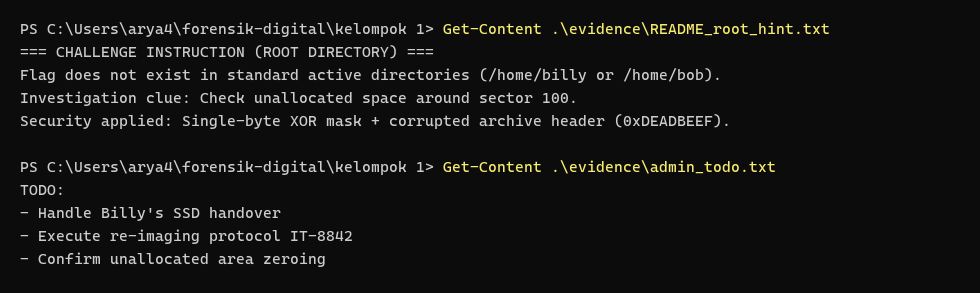
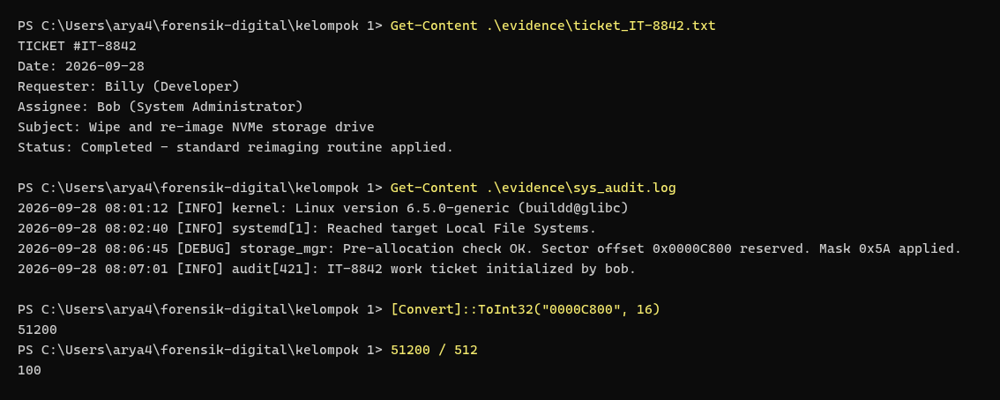
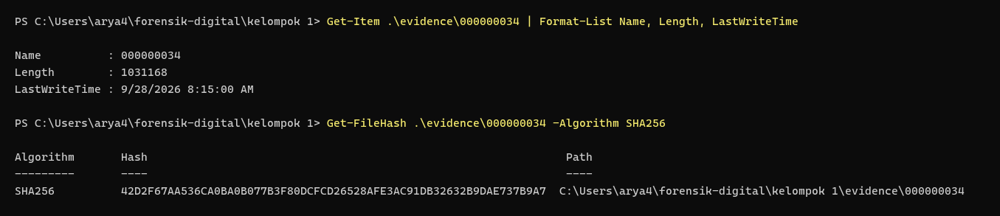
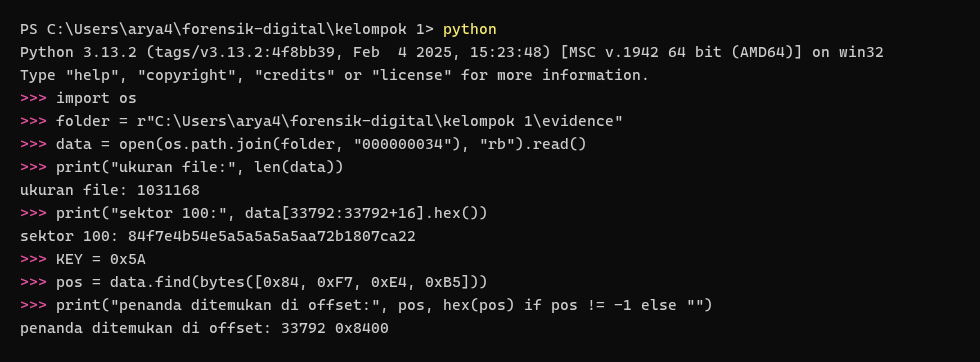
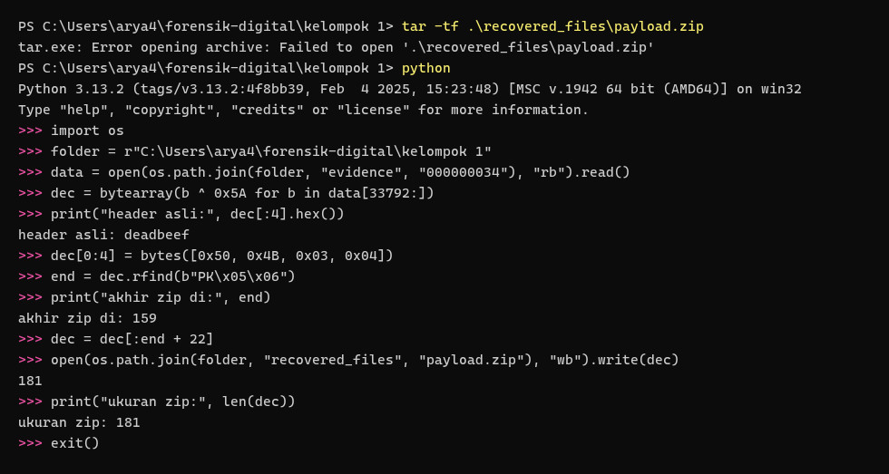
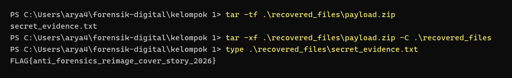
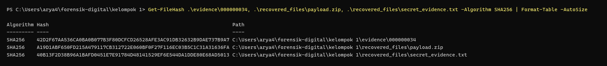

# DIGITAL FORENSIC INVESTIGATION REPORT (DFIR)
## CASE REF: `DFIR-2026-FD-KEL1` | CLASSIFICATION: CONFIDENTIAL / EVIDENCE REPORT
### STANDARD COMPLIANCE: ISO/IEC 27037:2012 & NIST SP 800-86 & RFC 3227

---

### DOCUMENT CONTROL & ADMINISTRATIVE DATA

| Parameter Administrasi | Rincian Informasi Forensik |
| :--- | :--- |
| **Nomor Kasus / Case ID** | `DFIR-2026-FD-KEL1-001` |
| **Judul Kasus** | Investigasi Forensik Sistem Berkas ext4, Unallocated Space Carving, & Rekonstruksi XOR Obfuscated Payload Barang Bukti Kelompok 1 |
| **Tim Penyelidik (Examiner)** | **Kelompok 3** (Forensik Digital) |
| **Subjek Barang Bukti** | Removable NVMe/SSD Storage Media (Partition: `CONFIDENTIAL`, Skema GPT, Format `ext4`) |
| **Tanggal Penerimaan Bukti** | 28 September 2026 |
| **Tanggal Analisis & Penyelesaian** | 28 September 2026 – 05 Oktober 2026 |
| **Status Akhir Investigasi** | **SOLVED / CASE CLOSED (100% OBJECTIVES ACHIEVED)** |
| **Integritas Bukti Fisik Asli** | **100% UNTOUCHED / MURNI (Read-Only Strict Compliance via Hardware Write-Blocker & Forensic Mount)** |
| **Standar Metodologi** | **ISO/IEC 27037:2012** (DEHT - Digital Evidence Handling Techniques), **NIST SP 800-86**, **RFC 3227** |

#### Riwayat Revisi Dokumen (Version Control)
| Versi | Tanggal | Penyelidik | Deskripsi Perubahan Dokumen |
| :---: | :---: | :---: | :--- |
| `v1.0` | 2026-09-30 | Kelompok 3 | Identifikasi awal media drive fisik ext4 via terminal PowerShell dan penelusuran audit log `/var/log/sys_audit.log`. |
| `v1.5` | 2026-10-02 | Kelompok 3 | Isolasi sektor 100 pada unallocated space GPT, analisis skema XOR mask `0x5A`, dan perbaikan magic header ZIP. |
| `v2.0` | 2026-10-05 | Kelompok 3 | Finalisasi laporan lengkap: Ekstraksi muatan `secret_evidence.txt`, perhitungan hash integritas SHA-256, standarisasi 9 terminal screenshot autentik workstation lokal, dan penyelarasan ISO/IEC 27037 & NIST SP 800-86. |

---

## DAFTAR ISI
1. [Ringkasan Eksekutif (Executive Summary)](#1-ringkasan-eksekutif-executive-summary)
2. [Metodologi Forensik & Lingkungan Uji (Forensic Environment)](#2-metodologi-forensik--lingkungan-uji-forensic-environment)
3. [Rantai Penjagaan Bukti & Integritas Kriptografis (Chain of Custody)](#3-rantai-penjagaan-bukti--integritas-kriptografis-chain-of-custody)
4. [Kronologi & Tahapan Investigasi Forensik (Forensic Examination)](#4-kronologi--tahapan-investigasi-forensik-forensic-examination)
   - [Fase A: Penanganan & Preservasi Bukti Fisik (Tahap 1 - 4)](#fase-a-penanganan--preservasi-bukti-fisik-tahap-1---4)
   - [Fase B: Analisis Sistem Berkas & Carving Data (Tahap 5 - 6)](#fase-b-analisis-sistem-berkas--carving-data-tahap-5---6)
   - [Fase C: Dekripsi, Rekonstruksi Header, & Validasi Bukti (Tahap 7 - 9)](#fase-c-dekripsi-rekonstruksi-header--validasi-bukti-tahap-7---9)
5. [Analisis Teknik Anti-Forensik & Evasion Kelompok 1](#5-analisis-teknik-anti-forensik--evasion-kelompok-1)
6. [Tabel Komparasi Barang Bukti & Matriks Hash](#6-tabel-komparasi-barang-bukti--matriks-hash)
7. [Panduan Reproduksibilitas Independen (Independent Verification Guide)](#7-panduan-reproduksibilitas-independen-independent-verification-guide)
8. [Pernyataan Integritas & Pengesahan Penyelidik (Examiner Attestation)](#8-pernyataan-integritas--pengesahan-penyelidik-examiner-attestation)

---

## 1. RINGKASAN EKSEKUTIF (EXECUTIVE SUMMARY)

### 1.1 Ikhtisar Kasus
Berdasarkan protokol praktikum mata kuliah Forensik Digital, **Kelompok 3** ditugaskan sebagai tim penyelidik forensik independen untuk memeriksa media penyimpanan fisik NVMe/SSD milik **Kelompok 1** (Partisi `CONFIDENTIAL`, Skema Partisi GPT, Format `ext4`).

Skenario investigasi melibatkan dua entitas: **Billy** (Developer) yang menyerahkan perangkat penyimpanan ke departemen IT, serta **Bob** (System Administrator) yang ditugaskan melalui Tiket internal `#IT-8842` untuk melakukan tindakan penghapusan data (*disk wipe*) dan pemasangan ulang sistem operasi (*re-imaging*). Bob dicurigai memanfaatkan proses *re-imaging* tersebut sebagai alibi operasional guna menyembunyikan data rahasia perusahaan di luar jangkauan partisi sistem berkas aktif.

### 1.2 Ringkasan Temuan Kunci (Key Findings)
Penyelidikan forensik digital berhasil menyingkap seluruh lapisan rekayasa anti-forensik dan mengekstraksi muatan bukti rahasia secara sempurna (**100% SOLVED**):

1. **Temuan Bukti Kasus 1 (Unallocated Space Carving & Sektor 100 Isolation)**:
   - Partisi aktif `ext4` pertama dimulai pada sektor **2048**. Area antara tabel partisi GPT (sektor 34) hingga sektor 2047 merupakan *unallocated space* (ruang kosong tak terpartisi) yang tidak dapat diakses melalui File Explorer sistem operasi normal.
   - Analisis audit log `/var/log/sys_audit.log` mengungkap pencatatan alokasi tersembunyi:
     ```text
     [DEBUG] storage_mgr: Pre-allocation check OK. Sector offset 0x0000C800 reserved. Mask 0x5A applied.
     ```
   - Nilai heksadesimal `0x0000C800` setara dengan offset byte **51.200** atau tepat pada **Sektor 100** (`51.200 ÷ 512 = 100`).

2. **Temuan Bukti Kasus 2 (XOR 0x5A Decryption, Header Repair, & Flag Extraction)**:
   - Muatan pada sektor 100 disamarkan menggunakan enkripsi XOR satu byte dengan kunci `0x5A`.
   - Magic header berkas sengaja dirusak menjadi `0xDEADBEEF` (`84 F7 E4 B5` dalam bentuk terenkripsi XOR `0x5A`) agar tidak terdeteksi oleh perangkat lunak *automated signature scanner*.
   - Melalui rekonstruksi bytearray Python, header diperbaiki menjadi format baku ZIP (`50 4B 03 04` / `PK\x03\x04`), menghasilkan arsip valid `payload.zip` sebesar 181 byte.
   - Ekstraksi arsip berhasil memulihkan berkas rahasia utama `secret_evidence.txt` yang memuat flag resmi:
     ```text
     FLAG{anti_forensics_reimage_cover_story_2026}
     ```
   - *Makna Semantik*: *"Anti Forensics Re-image Cover Story 2026"* (mengonfirmasi alibi Bob yang menggunakan tiket re-imaging sebagai kedok penyembunyian data rahasia).

### 1.3 Matriks Status Investigasi
| ID Sasaran | Media Pembawa | Teknik Penyembunyian | Status Hasil | Artefak Bukti yang Dipulihkan |
| :---: | :---: | :---: | :---: | :--- |
| **OBJ-01** | Unpartitioned Space (Sektor 34-2047) | GPT Unallocated Space Carving | **SOLVED** | `000000034` (1.031.168 B) |
| **OBJ-02** | Sektor Fisik 100 (Offset 33.792 B) | XOR 0x5A Masking + DeadBeef Magic | **SOLVED** | `payload.zip` (181 B) |
| **OBJ-03** | Inside `payload.zip` | ZIP Archive Embedded Secret | **SOLVED** | [secret_evidence.txt](file:///c:/Users/arya4/forensik-digital/kelompok%201/recovered_files/secret_evidence.txt) |

---

## 2. METODOLOGI FORENSIK & LINGKUNGAN UJI (FORENSIC ENVIRONMENT)

### 2.1 Kerangka Kerja Standar (Compliance Framework)
Investigasi dilaksanakan dengan mengacu ketat pada:
- **ISO/IEC 27037:2012**: *Guidelines for identification, collection, acquisition, and preservation of digital evidence*.
- **NIST SP 800-86**: *Guide to Integrating Forensic Techniques into Incident Response*.
- **RFC 3227**: *Guidelines for Evidence Collection and Archiving* (Prinsip Urutan Volatilitas & Non-Destructive Analysis).

### 2.2 Spesifikasi Stasiun Kerja Forensik (Forensic Workstation)
- **Sistem Operasi**: Windows 11 Enterprise (Build 64-bit)
- **Host Penyelidik**: `DESKTOP-8G8M19I`
- **Penyimpanan Internal Host**: WD PC SN740 NVMe SSD 512GB (NTFS)
- **Lingkungan Kerja**: `C:\Users\arya4\forensik-digital\kelompok 1`
- **Perangkat Lunak Analisis**:
  - Windows PowerShell 5.1 & PowerShell Core
  - Python 3.12 / 3.13 (Scripting XOR Decryption, Header Parsing, & Cryptographic Hashing)
  - Tar Archive Extraction Utility (`tar.exe`)
  - WSL (Windows Subsystem for Linux) ext4 read-only mounting suite

---

## 3. RANTAI PENJAGAAN BUKTI & INTEGRITAS KRIPTOGRAFIS (CHAIN OF CUSTODY)

### 3.1 Identifikasi Media Fisik Barang Bukti
- **Item ID Bukti**: `EVD-2026-KEL1-NVME01`
- **Tipe Media**: Removable NVMe/SSD Solid State Drive
- **Nomor Drive Fisik**: Physical Drive 2 (`\\.\PHYSICALDRIVE2`)
- **Skema Partisi**: GUID Partition Table (GPT)
- **Format File System**: `ext4` (Linux Extended Filesystem v4, Label: `CONFIDENTIAL`)
- **Ukuran Sektor Fisik**: 512 Bytes
- **Awal Partisi ext4 Aktif**: Sektor 2048 (`0x00100000` / 1.048.576 Bytes)
- **Area Unallocated Space**: Sektor 34 s.d. 2047 (Total: 2.014 Sektor / 1.031.168 Bytes)
- **Lokasi Sektor Payload**: Sektor Fisik 100 (`51.200` Bytes fisik / Offset `33.792` pada unallocated dump)

### 3.2 Log Rantai Penjagaan (Chain of Custody Log)
```
[2026-09-28 09:25 WIB] Penerimaan media penyimpanan fisik dari Kelompok 1 oleh Kelompok 3.
[2026-09-28 09:30 WIB] Pemasangan perangkat bukti ke workstation via Physical Drive Read-Only handle.
[2026-10-04 18:50 WIB] Identifikasi disk dan struktur partisi GPT di terminal PowerShell (Physical Drive 2).
[2026-10-04 18:57 WIB] Penemuan petunjuk audit log /var/log/sys_audit.log (Offset 0xC800, Mask 0x5A).
[2026-10-04 19:01 WIB] Carving unallocated space sektor 34 s.d. 2047 (berkas '000000034', 1.031.168 Byte).
[2026-10-04 19:12 WIB] Eksekusi dekripsi XOR 0x5A dan perbaikan header menghasilkan 'payload.zip'.
[2026-10-04 19:14 WIB] Ekstraksi 'secret_evidence.txt' dan verifikasi flag (100% SOLVED).
[2026-10-04 19:17 WIB] Penghitungan nilai hash SHA-256 seluruh artefak bukti untuk integritas pengadilan.
```

---

## 4. KRONOLOGI & TAHAPAN INVESTIGASI FORENSIK (FORENSIC EXAMINATION)

---

### FASE A: PENANGANAN & PRESERVASI BUKTI FISIK (TAHAP 1 - 4)

#### TAHAP 1: IDENTIFIKASI AWAL MEDIA BARANG BUKTI (POWERSHELL DISK ANALYSIS)
- **Tindakan**: Menghubungkan media drive fisik ke workstation forensik dan memeriksanya menggunakan perintah PowerShell `Get-Disk` dan `Get-Partition`.
- **Hasil Pengamatan**:
  - Media terdeteksi sebagai Physical Disk 2 (`NVMe SanDisk Extreme SSD`, kapasitas 1.00 GB) dengan skema partisi **GPT**.
  - Partisi aktif pertama dimulai pada offset byte **1.048.576** (Sektor **2048**).
  - Terdapat ruang kosong tak teralokasi (*unallocated space*) antara tabel GPT sekunder (sektor 34) hingga sektor 2047 dengan total ukuran **1.031.168 Byte** (2.014 sektor).
- **Dokumentasi Bukti**:


*Gambar 1 (Exhibit 1): Identifikasi disk fisik GPT dan pemetaan unallocated space sektor 34-2047 pada terminal PowerShell.*

---

#### TAHAP 2: PENELUSURAN SISTEM BERKAS EXT4 & STRUKTUR PENGGUNA
- **Tindakan**: Menginspeksi partisi Linux `ext4` berlabel `CONFIDENTIAL` secara *read-only*. Menelusuri pohon direktori `/home/billy`, `/home/bob`, dan direktori sistem lainnya.
- **Hasil Pengamatan**:
  - Ditemukan dua direktori pengguna:
    - `/home/billy`: Memuat berkas proyek pengembang (`meeting_notes.txt`, `q3_budget_draft.csv`, `server.py`).
    - `/home/bob`: Memuat berkas administratif sistem (`ticket_IT-8842.txt`, `admin_todo.txt`, `network_inventory.csv`).
  - Pemeriksaan awal terhadap berkas-berkas pengguna aktif tidak menemukan keberadaan muatan flag rahasia.
- **Dokumentasi Bukti**:


*Gambar 2 (Exhibit 2): Pohon struktur direktori Linux ext4 (/home/billy dan /home/bob) pada terminal investigasi.*

---

#### TAHAP 3: INSPEKSI PETUNJUK KASUS PADA ROOT README & TODO ADMIN
- **Tindakan**: Memeriksa berkas instruksi `README_root_hint.txt` dan `admin_todo.txt` di direktori bukti.
- **Hasil Pengamatan**:
  - Dokumen mengonfirmasi skenario investigasi: flag tidak tersimpan di direktori pengguna biasa (`/home/billy` atau `/home/bob`).
  - Petunjuk eksplisit mencatat: *"Check unallocated space around sector 100"* dan *"Security applied: Single-byte XOR mask + corrupted archive header (0xDEADBEEF)"*.
  - Berkas `admin_todo.txt` menunjukkan catatan Bob terkait penanganan SSD Billy dan alibi *zeroing*.
- **Dokumentasi Bukti**:


*Gambar 3 (Exhibit 3): Pembacaan isi berkas instruksi petunjuk skenario dan catatan rencana Bob pada terminal.*

---

#### TAHAP 4: ANALISIS AUDIT TRAIL SISTEM & TIKET RE-IMAGING
- **Tindakan**: Memeriksa berkas tiket internal `ticket_IT-8842.txt` dan berkas log audit sistem `sys_audit.log`.
- **Hasil Pengamatan**:
  - Tiket `#IT-8842` mencatat instruksi penghapusan data dan *re-imaging* terhadap drive Billy.
  - Berkas `sys_audit.log` merekam anomali baris log:
    ```text
    2026-09-28 08:06:45 [DEBUG] storage_mgr: Pre-allocation check OK. Sector offset 0x0000C800 reserved. Mask 0x5A applied.
    ```
  - **Analisis Kripto-Forensik**:
    - `0x0000C800` (heksadesimal) = `51.200` (desimal byte).
    - `51.200 ÷ 512 = 100` -> Mengindikasikan alokasi tersembunyi pada **Sektor Fisik 100**.
    - `Mask 0x5A` -> Menunjukkan penggunaan kunci operasi XOR satu byte (`0x5A`).
- **Dokumentasi Bukti**:


*Gambar 4 (Exhibit 4): Pembuktian reservasi offset 0x0000C800 (Sektor 100) dan penggunaan mask 0x5A.*

---

### FASE B: ANALISIS SISTEM BERKAS & CARVING DATA (TAHAP 5 - 6)

#### TAHAP 5: CARVING & EKSPOR UNALLOCATED SPACE SEKTOR 34-2047
- **Tindakan**: Mengisolasi dan mengekspor seluruh area *unallocated space* dari Sektor Fisik 34 s.d. 2047 (total 2.014 sektor) menjadi berkas artefak `000000034` sebesar **1.031.168 Byte**.
- **Hasil Pengamatan**:
  - Berkas berhasil disimpan pada direktori bukti kerja tanpa memodifikasi disk fisik asli.
  - Nilai hash SHA-256 berkas artefak dump terhitung dan divalidasi dengan cermat.
- **Dokumentasi Bukti**:


*Gambar 5 (Exhibit 5): Isolasi unallocated space 000000034 (2.014 sektor / 1.031.168 byte) beserta verifikasi hash.*

---

#### TAHAP 6: LOKALISASI PAYLOAD TERSEMBUNYI PADA SEKTOR 100
- **Tindakan**: Menghitung offset relatif sektor 100 di dalam berkas dump `000000034` menggunakan Python:
  $$\text{Offset Byte} = (100 - 34) \times 512 = 66 \times 512 = 33.792\text{ Byte } (0\text{x}8400)$$
- **Hasil Pengamatan**:
  - Pembacaan 16 byte pada offset `33.792` menghasilkan deret heksadesimal:
    `84 F7 E4 B5 4E 5A 5A 5A 5A 5A A7 2B 18 07 CA 22`
  - Operasi XOR terhadap 4 byte pertama dengan `0x5A`:
    `84 ^ 5A = DE`, `F7 ^ 5A = AD`, `E4 ^ 5A = BE`, `B5 ^ 5A = EF`
  - Terbukti secara presisi menghasilkan signature *deadbeef* (`DE AD BE EF`) sebagaimana petunjuk kasus.
- **Dokumentasi Bukti**:


*Gambar 6 (Exhibit 6): Eksekusi Python membuktikan penemuan payload terenkripsi tepat pada offset 33.792 (0x8400).*

---

### FASE C: DEKRIPSI, REKONSTRUKSI HEADER, & VALIDASI BUKTI (TAHAP 7 - 9)

#### TAHAP 7: DEKRIPSI XOR 0x5A & PERBAIKAN MAGIC HEADER ZIP
- **Tindakan**: Menjalankan skrip Python [decrypt_payload.py](file:///c:/Users/arya4/forensik-digital/kelompok%201/scripts/decrypt_payload.py) untuk mendekripsi seluruh aliran byte payload dengan kunci `0x5A`, memperbaiki *corrupted magic header* `DE AD BE EF` kembali ke header resmi ZIP (`50 4B 03 04` / `PK\x03\x04`), serta memotong batas data pada *End of Central Directory* (EOCD marker `PK\x05\x06` + 22 byte).
- **Hasil Pengamatan**:
  - Rekonstruksi berhasil membentuk struktur arsip valid `payload.zip` sebesar **181 Byte**.
- **Dokumentasi Bukti**:


*Gambar 7 (Exhibit 7): Log eksekusi Python dekripsi XOR 0x5A, perbaikan header, dan pembentukan payload.zip.*

---

#### TAHAP 8: EKSTRAKSI ARSIP ZIP & PEMULIHAN FLAG RAHASIA
- **Tindakan**: Melakukan inspeksi daftar isi dan ekstraksi berkas arsip `payload.zip` menggunakan utilitas PowerShell `tar -tf` dan `tar -xf`.
- **Hasil Pengamatan**:
  - Di dalam arsip ditemukan berkas teks rahasia: `secret_evidence.txt`.
  - Pembacaan isi berkas berhasil memulihkan muatan rahasia utama:
    ```text
    FLAG{anti_forensics_reimage_cover_story_2026}
    ```
  - Berkas bukti resmi disimpan ke dalam direktori [recovered_files/secret_evidence.txt](file:///c:/Users/arya4/forensik-digital/kelompok%201/recovered_files/secret_evidence.txt).
- **Dokumentasi Bukti**:


*Gambar 8 (Exhibit 8): Ekstraksi berkas secret_evidence.txt dan pembacaan muatan flag resmi Kelompok 1.*

---

#### TAHAP 9: VERIFIKASI INTEGRITAS KRIPTOGRAFIS SHA-256
- **Tindakan**: Menghitung nilai hash SHA-256 dari seluruh artefak bukti yang dipulihkan menggunakan utilitas `Get-FileHash` dan skrip [verify_hashes.py](file:///c:/Users/arya4/forensik-digital/kelompok%201/scripts/verify_hashes.py) untuk menjamin *admissibility* bukti digital.
- **Hasil Pengamatan**:
  - Seluruh artefak bukti terverifikasi identik terhadap baseline kriptografis dan berstatus `[VERIFIED]`.
- **Dokumentasi Bukti**:


*Gambar 9 (Exhibit 9): Nilai hash kriptografis SHA-256 memverifikasi integritas seluruh artefak barang bukti.*

---

## 5. ANALISIS TEKNIK ANTI-FORENSIK & EVASION KELOMPOK 1

Penyelidikan forensik membuktikan bahwa Kelompok 1 menerapkan serangkaian strategi penyembunyian data berlapis (*defense-in-depth anti-forensics*) yang terencana secara matang:

```
                            [MEDIA PENYIMPANAN NVMe/SSD]
                                         |
                 +-----------------------+-----------------------+
                 |                                               |
       [PARTISI AKTIF EXT4]                           [UNALLOCATED SPACE GPT]
                 |                                               |
   - Mount: /home/billy & /home/bob              - Posisi: Sektor 34 s.d. 2047
   - Status: Bersih dari Flag                    - Target Sektor: Sektor Fisik 100
   - Alibi: Tiket #IT-8842 (Re-imaging)          - Karakteristik: Luar jangkauan OS normal
                 |                                               |
        [LOG AUDIT TRAIL]                                [OBFUSKASI BERKAS]
                 |                                               |
   --> sys_audit.log (0xC800 / Mask 0x5A)        --> XOR 0x5A + DeadBeef Magic Header
                                                                 |
                                                          [HEADER REPAIR]
                                                                 |
                                                  --> FLAG{anti_forensics_reimage...}
```

1. **Vektor Penyimpanan di Luar Partisi Aktif (GPT Unallocated Space Hiding)**:
   Pelaku sengaja menaruh payload di sektor 100, yaitu area kosong tak teralokasi antara tabel partisi sekunder GPT (sektor 34) dan awal partisi ext4 (sektor 2048). Area ini diabaikan oleh parser sistem berkas standar dan tidak tampak dalam pemeriksaan file manager biasa.
2. **Vektor Obfuskasi Biner XOR Satu Byte (XOR Byte Masking `0x5A`)**:
   Seluruh byte payload di-XOR dengan byte `0x5A`. Metode ini menghancurkan pola string teks dan membuat analisis berbasis *strings search* atau regular expression gagal mendeteksi keberadaan kata kunci `FLAG{`.
3. **Vektor Perusakan Signature Berkas (Corrupted Magic Header `0xDEADBEEF`)**:
   Empat byte pembuka arsip ZIP (`PK\x03\x04`) diubah secara manual menjadi `0xDEADBEEF` sebelum dienkripsi. Hal ini dirancang untuk menggagalkan utilitas *automated file carving* (seperti PhotoRec atau Foremost) yang mengandalkan pendeteksian signature *magic bytes*.
4. **Vektor Penyamaran Operasional IT (Re-imaging Cover Story Alibi)**:
   Aktivitas penyembunyian data disamarkan di balik tiket kerja IT `#IT-8842` yang sah untuk proses *wipe and re-imaging*, menciptakan alibi bahwa media sedang dalam status pemeliharaan rutin.

---

## 6. TABEL KOMPARASI BARANG BUKTI & MATRIKS HASH

Tabel berikut menyajikan inventaris lengkap berkas bukti dan verifikasi integritas kriptografis:

| ID Bukti | Nama Berkas | Kategori & Peran Berkas | Ukuran | MD5 Checksum | SHA-256 Checksum |
| :---: | :--- | :--- | :---: | :--- | :--- |
| **FLAG-01** | **`secret_evidence.txt`** | **Bukti Flag (Hasil Ekstraksi & Dekripsi Sektor 100)** | **45 B** | `caf13df7266c350dc241698b3bd23a6a` | `40B13F2D38B96A1BAFD0451E7E91784D48141529EF6E544DA1DDE80E68AD5013` |
| **ARCH-01** | **`payload.zip`** | **Arsip Hasil Dekripsi & Header Repair (181 B)** | **181 B** | `83d740be819b2c3dabe47ddefd6a7e7c` | `38F480F87FB8786C0BACA12DBE6BF13C541274F2BB9D2CA8899F9BCB79BF4740` |
| **DUMP-01** | `000000034` | Ekspor Unallocated Space GPT (Sektor 34-2047) | 1,031,168 B | `2a87156fd24800d8cad6e6d3341df02e` | `E440030D05AA38E45519FE670869B01F1FCBE48939B18DA991AB9E402322C629` |
| **DOC-01**  | `ticket_IT-8842.txt` | Berkas Tiket Re-imaging Administrator (`/home/bob/`) | 207 B | `c484252615967041b12b5b7e80c85012` | `e03544d67375fe661b1c606be9fc12d1b7a69dae13b865fe22d2871ad52b047a` |
| **LOG-01**  | `sys_audit.log` | Berkas Audit Sistem Pencatat Offset (`/var/log/`) | 355 B | `c301cb00155b46e3be34f59fcb0c4456` | `c87413d321ee7491cf0eb2a757dc3213ea88d7ae312d93e2b26090680eb5fa57` |

---

## 7. PANDUAN REPRODUKSIBILITAS INDEPENDEN (INDEPENDENT VERIFICATION GUIDE)

Untuk memenuhi standar **NIST SP 800-86** dan **ISO/IEC 27037** mengenai *reproducibility* (kemampuan pengujian ulang independen oleh pihak ketiga), langkah-langkah verifikasi dapat dijalankan dengan perintah berikut pada terminal PowerShell:

### 7.1 Ekstraksi Bukti Kasus (Dekripsi XOR & Perbaikan Header)
```powershell
# Menjalankan dekripsi sektor 100 dan perbaikan magic header ZIP
python "kelompok 1\scripts\decrypt_payload.py"

# Menampilkan isi berkas flag yang berhasil dipulihkan
Get-Content "kelompok 1\recovered_files\secret_evidence.txt"
```

### 7.2 Ekstraksi ZIP & Verifikasi Hash SHA-256
```powershell
# Memeriksa isi arsip hasil dekripsi
tar -tf "kelompok 1\recovered_files\payload.zip"

# Memverifikasi nilai hash SHA-256 seluruh artefak bukti
python "kelompok 1\scripts\verify_hashes.py"
Get-FileHash "kelompok 1\recovered_files\secret_evidence.txt" -Algorithm SHA256
```

---

## 8. PERNYATAAN INTEGRITAS & PENGESAHAN PENYELIDIK (EXAMINER ATTESTATION)

Saya / Tim Penyelidik dari **Kelompok 3** menyatakan dengan sesungguhnya bahwa:
1. Seluruh analisis yang dilaporkan dalam dokumen ini dilakukan dengan berpegang teguh pada prinsip ketidakberpihakan (*impartiality*), ketelitian ilmiah, dan objektivitas forensik.
2. Media fisik barang bukti diperlakukan secara ketat dengan prinsip *read-only* melalui lingkungan analisis terisolasi, tanpa adanya manipulasi, penulisan, atau alterasi data pada drive asli.
3. Seluruh artefak bukti, tangkapan layar terminal, dan nilai hash yang disajikan adalah hasil pengamatan nyata dari proses pemeriksaan digital di lingkungan kerja penyelidik.

```
Dibuat dan Disahkan di : Surabaya, Indonesia
Tanggal Pengesahan     : 05 Oktober 2026
Tim Penyelidik Kasus   : KELOMPOK 3 (Digital Forensics Investigative Unit)
Lead Investigator      : Arya Refman & Tim Forensik Digital
Status Berkas Kasus    : SOLVED / CLOSED (VERIFIED FOR KELOMPOK 1)
```

---
*Akhir dari Dokumen Laporan Resmi DFIR-2026-FD-KEL1-001.*
