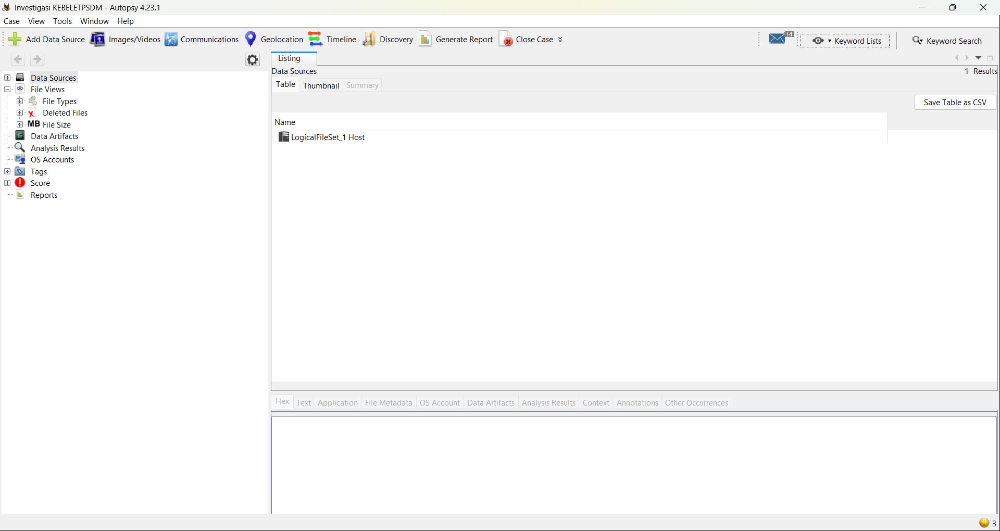
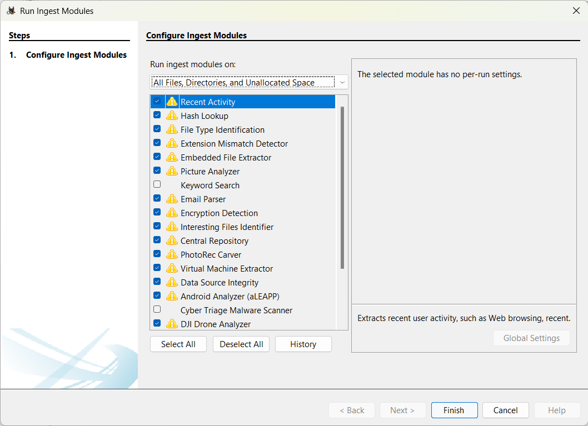
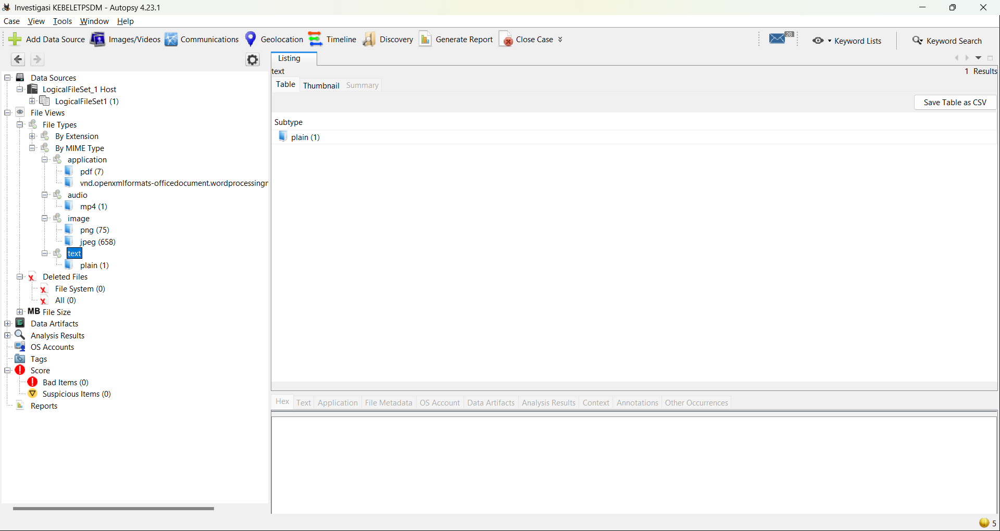
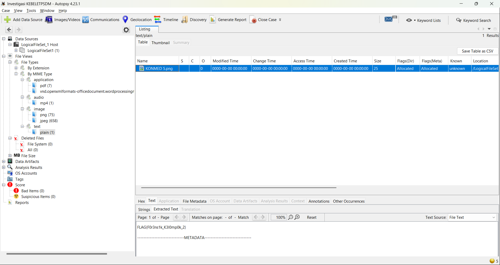

# DIGITAL FORENSIC INVESTIGATION REPORT (DFIR)

## Investigasi Barang Bukti Digital Kelompok 2

## 1. Ringkasan Eksekutif

Investigasi dilakukan terhadap data digital **KEBELET PSDM** milik Kelompok 2 menggunakan **Autopsy 4.23.1**. Data dianalisis sebagai *Logical Files* dengan fokus pada identifikasi tipe file berdasarkan konten. Dari hasil pemeriksaan MIME type ditemukan satu file yang diklasifikasikan sebagai `text/plain`, yaitu `KONMED 5.png`.

File tersebut memiliki ekstensi `.png`, tetapi tipe aktualnya adalah teks dan ukurannya hanya **25 byte**. Pemeriksaan melalui *Text Viewer* Autopsy menunjukkan isi:

```text
FLAG{F0r3ns1k_K3l0mp0k_2}
```

Dengan demikian, barang bukti Kelompok 2 dinyatakan **SOLVED**.

## 2. Lingkungan dan Metode Analisis

| Komponen | Keterangan |
|---|---|
| Tool | Autopsy 4.23.1 |
| Data source | Logical Files |
| Modul utama | File Type Identification |
| Modul pendukung | Extension Mismatch Detector, Keyword Search |
| Metode pemeriksaan | MIME type analysis, Text Viewer |
| Status | SOLVED |

Alur pemeriksaan:

`Data Source → Ingest → File Type Identification → MIME Type Analysis → Identifikasi Anomali → Pemeriksaan Konten → Validasi Flag`

## 3. Tahapan Investigasi

### 3.1 Penambahan Data Source

Data `KEBELET PSDM` ditambahkan ke Autopsy sebagai **Logical Files**. Setelah data source berhasil ditambahkan, Autopsy menampilkan `LogicalFileSet_1 Host` sebagai host pemeriksaan.



*Gambar 1. Data source berhasil ditambahkan ke Autopsy.*

### 3.2 Konfigurasi Ingest

Proses *ingest* dijalankan dengan modul yang relevan untuk identifikasi tipe file. Modul utama yang digunakan adalah **File Type Identification**, dengan **Extension Mismatch Detector** dan **Keyword Search** sebagai modul pendukung.



*Gambar 2. Konfigurasi ingest modules pada Autopsy.*

### 3.3 Analisis MIME Type

Hasil identifikasi diperiksa melalui menu:

`File Views → File Types → By MIME Type`

Autopsy mengelompokkan file berdasarkan tipe kontennya. Pada hasil pemeriksaan ditemukan **75 file PNG**, **658 file JPEG**, dan hanya **1 file `text/plain`**. Keberadaan satu file teks tersebut menjadi anomali yang diperiksa lebih lanjut.



*Gambar 3. Hasil identifikasi MIME type menunjukkan satu file text/plain.*

### 3.4 Identifikasi File Mencurigakan dan Flag

Kategori `text → plain (1)` berisi file bernama **`KONMED 5.png`**. Hasil Autopsy menunjukkan ukuran file hanya **25 byte**. Meskipun nama file menggunakan ekstensi `.png`, Autopsy mengidentifikasinya sebagai `text/plain`.

Ketika file diperiksa melalui tab **Text**, ditemukan:

```text
FLAG{F0r3ns1k_K3l0mp0k_2}
```



*Gambar 4. File KONMED 5.png teridentifikasi sebagai text/plain dan berisi flag.*

## 4. Analisis Teknik Penyembunyian

Teknik yang ditemukan berupa **file masquerading / extension mismatch sederhana**. File teks diberi nama dengan ekstensi `.png` sehingga secara sekilas terlihat sebagai file gambar. Pemeriksaan berdasarkan MIME type menunjukkan bahwa konten aktualnya adalah `text/plain`.

| Atribut | Hasil |
|---|---|
| Nama file | `KONMED 5.png` |
| Ekstensi | `.png` |
| Tipe aktual | `text/plain` |
| Ukuran | 25 byte |
| Flag | `FLAG{F0r3ns1k_K3l0mp0k_2}` |

## 5. Artefak Hasil Investigasi

Salinan konten artefak disimpan pada:

`recovered_files/KONMED_5.txt`

Nilai hash salinan tersebut adalah:

| Algoritma | Hash |
|---|---|
| MD5 | `6d8c07d5796c68ca28814741424cb395` |
| SHA-256 | `90e4906477a0254757e822bdb9736935fb3662ef156c8b6d38bd614fd1aaccce` |

Hash di atas berlaku untuk file `KONMED_5.txt` yang terdapat pada folder hasil investigasi, bukan klaim hash media fisik asli.

## 6. Reproduksi Hasil

Temuan dapat direproduksi dengan langkah berikut:

1. Buka case pada Autopsy 4.23.1.
2. Tambahkan data `KEBELET PSDM` sebagai *Logical Files*.
3. Jalankan **File Type Identification**.
4. Buka `File Views → File Types → By MIME Type`.
5. Pilih `text → plain (1)`.
6. Pilih `KONMED 5.png`.
7. Buka tab **Text**.
8. Verifikasi bahwa konten yang muncul adalah `FLAG{F0r3ns1k_K3l0mp0k_2}`.

Verifikasi salinan artefak juga dapat dilakukan dengan:

```bash
python scripts/verify_evidence.py
```

## 7. Kesimpulan

Investigasi menggunakan Autopsy berhasil menemukan satu file yang disamarkan sebagai gambar PNG. `KONMED 5.png` memiliki ekstensi `.png`, tetapi hasil identifikasi menunjukkan tipe `text/plain`. Pemeriksaan konten menghasilkan flag `FLAG{F0r3ns1k_K3l0mp0k_2}` sehingga investigasi barang bukti Kelompok 2 dinyatakan **SOLVED**.
