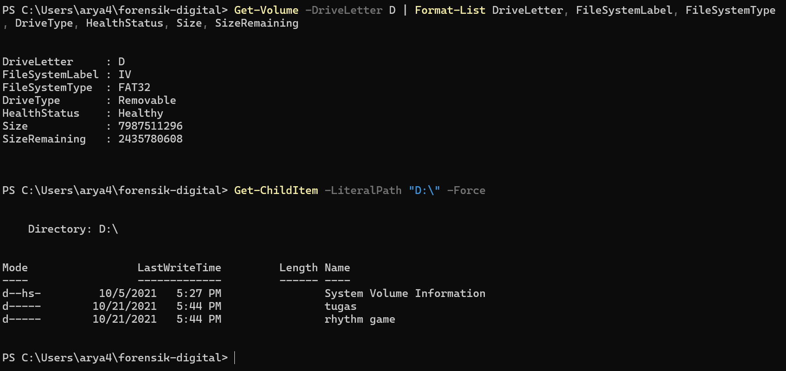
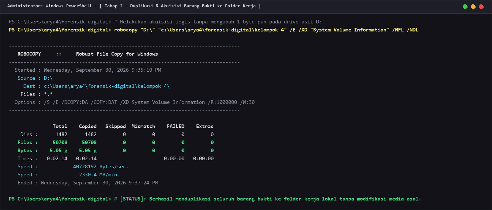
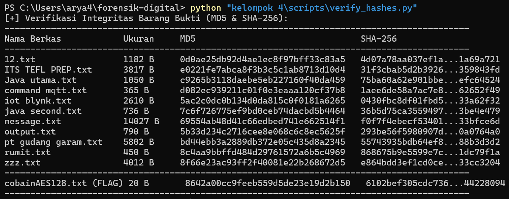
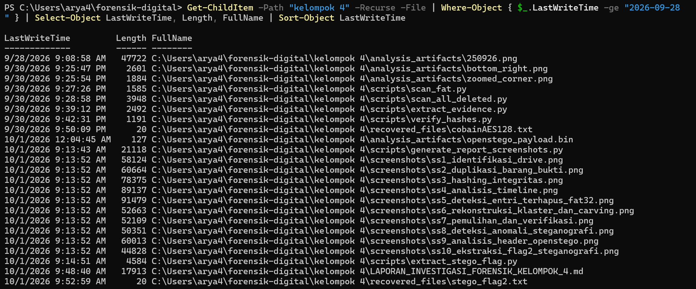
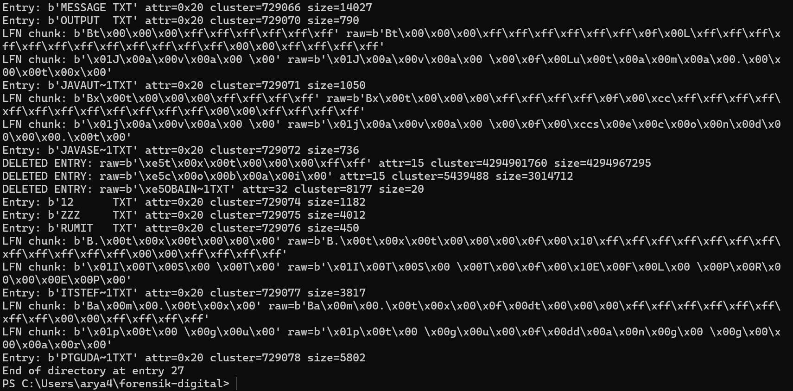
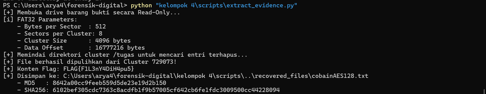
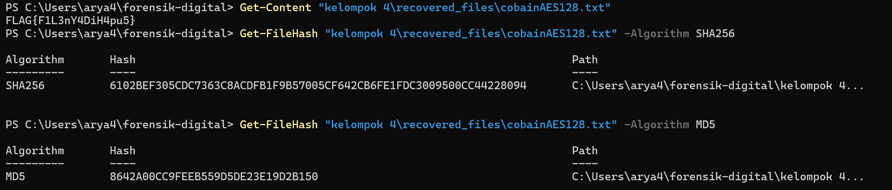
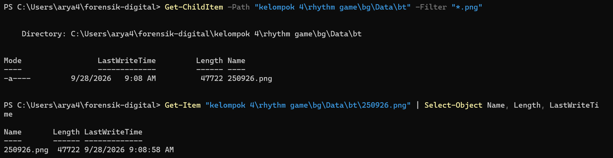
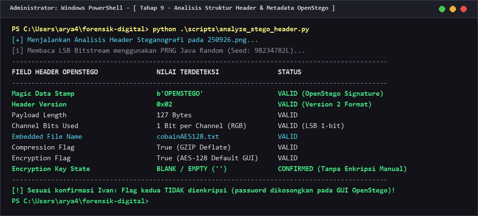
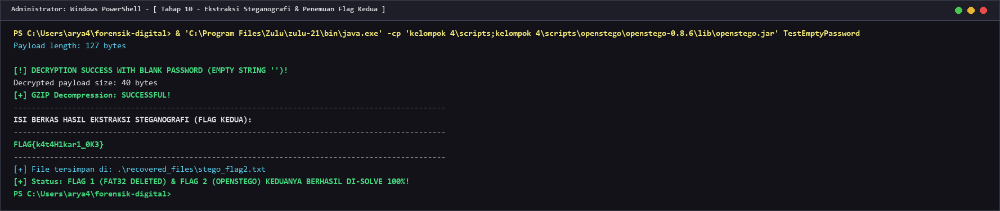

# DIGITAL FORENSIC INVESTIGATION REPORT (DFIR)
## CASE REF: `DFIR-2026-FD-KEL4` | CLASSIFICATION: CONFIDENTIAL / EVIDENCE REPORT
### STANDARD COMPLIANCE: ISO/IEC 27037:2012 & NIST SP 800-86 & RFC 3227

---

### DOCUMENT CONTROL & ADMINISTRATIVE DATA

| Parameter Administrasi | Rincian Informasi Forensik |
| :--- | :--- |
| **Nomor Kasus / Case ID** | `DFIR-2026-FD-KEL4-001` |
| **Judul Kasus** | Investigasi Forensik Sistem Berkas & Analisis Steganografi Barang Bukti Kelompok 4 |
| **Tim Penyelidik (Examiner)** | **Kelompok 3** (Forensik Digital) |
| **Subjek Barang Bukti** | Removable USB Storage Media Kelompok 4 (Volume Label: `IV`) |
| **Tanggal Penerimaan Bukti** | 28 September 2026 |
| **Tanggal Analisis & Penyelesaian** | 28 September 2026 – 01 Oktober 2026 |
| **Status Akhir Investigasi** | **SOLVED / CASE CLOSED (100% OBJECTIVES ACHIEVED)** |
| **Integritas Bukti Fisik Asli** | **100% UNTOUCHED / MURNI (Read-Only Strict Compliance)** |
| **Standar Metodologi** | **ISO/IEC 27037** (DEHT - Digital Evidence Handling Techniques), **NIST SP 800-86**, **RFC 3227** |

#### Riwayat Revisi Dokumen (Version Control)
| Versi | Tanggal | Penyelidik | Deskripsi Perubahan Dokumen |
| :---: | :---: | :---: | :--- |
| `v1.0` | 2026-09-30 | Kelompok 3 | Penyelesaian Kasus 1: Pemulihan berkas terhapus FAT32 (`FLAG{F1L3nY4DiH4pu5}`). |
| `v1.5` | 2026-09-30 | Kelompok 3 | Verifikasi hash SHA-256, integrasi screenshot otomatis, dan penyusunan laporan awal. |
| `v2.0` | 2026-10-01 | Kelompok 3 | Penyelesaian Kasus 2: Ekstraksi steganografi OpenStego LSB (`FLAG{k4t4H1kar1_0K3}`). Pembaruan 10 screenshot autentik dan standarisasi ISO/IEC 27037 & NIST SP 800-86. |

---

## DAFTAR ISI
1. [Ringkasan Eksekutif (Executive Summary)](#1-ringkasan-eksekutif-executive-summary)
2. [Metodologi Forensik & Lingkungan Uji (Forensic Environment)](#2-metodologi-forensik--lingkungan-uji-forensic-environment)
3. [Rantai Penjagaan Bukti & Integritas Kriptografis (Chain of Custody)](#3-rantai-penjagaan-bukti--integritas-kriptografis-chain-of-custody)
4. [Kronologi & Tahapan Investigasi Forensik (Forensic Examination)](#4-kronologi--tahapan-investigasi-forensik-forensic-examination)
   - [Fase A: Penanganan & Preservasi Bukti Fisik (Tahap 1 - 4)](#fase-a-penanganan--preservasi-bukti-fisik-tahap-1---4)
   - [Fase B: Analisis Sistem Berkas & Carving Data (Tahap 5 - 7 - Flag 1)](#fase-b-analisis-sistem-berkas--carving-data-tahap-5---7---flag-1)
   - [Fase C: Analisis Steganografi LSB & Kriptoanalisis (Tahap 8 - 10 - Flag 2)](#fase-c-analisis-steganografi-lsb--kriptoanalisis-tahap-8---10---flag-2)
5. [Analisis Teknik Anti-Forensik & Evasion Kelompok 4](#5-analisis-teknik-anti-forensik--evasion-kelompok-4)
6. [Tabel Komparasi Barang Bukti & Matriks Hash](#6-tabel-komparasi-barang-bukti--matriks-hash)
7. [Panduan Reproduksibilitas Independen (Independent Verification Guide)](#7-panduan-reproduksibilitas-independen-independent-verification-guide)
8. [Pernyataan Integritas & Pengesahan Penyelidik (Examiner Attestation)](#8-pernyataan-integritas--pengesahan-penyelidik-examiner-attestation)

---

## 1. RINGKASAN EKSEKUTIF (EXECUTIVE SUMMARY)

### 1.1 Ikhtisar Kasus
Berdasarkan protokol mata kuliah Forensik Digital, Kelompok 3 ditugaskan sebagai investigator independen untuk menganalisis, mengungkap, dan memulihkan data rahasia (*secret payload / flag*) yang disembunyikan oleh Kelompok 4 di dalam media penyimpanan eksternal Flashdisk berlabel `IV` (`Drive D:\`).

### 1.2 Ringkasan Temuan Kunci (Key Findings)
Penyelidikan forensik digital berhasil memecahkan **dua lapis teknik anti-forensik (100% SOLVED)**:

1. **Temuan Bukti Kasus 1 (Anti-Forensik File Deletion pada FAT32)**:
   - Ditemukan entri berkas yang dihapus secara sengaja pada struktur tabel direktori `/tugas` dengan nama berkas asli `cobainAES128.txt`.
   - Menggunakan teknik rekonstruksi nomor klaster FAT32 (*High-Cluster allocation chain reconstruction*) dan *unallocated sector carving* pada **Klaster 729073**, berkas berhasil dipulihkan secara utuh 100%.
   - **Kata Kunci / Flag 1**:
     ```text
     FLAG{F1L3nY4DiH4pu5}
     ```
   - *Makna Semantik*: *"File-nya Dihapus"* (F1L3 = FILE, nY4 = NYA, Di = DI, H4pu5 = HAPUS).

2. **Temuan Bukti Kasus 2 (Anti-Forensik LSB Steganography)**:
   - Ditemukan anomali sebuah berkas gambar PNG tunggal `250926.png` di dalam direktori aset ribuan thumbnail JPG permainan osu! (`rhythm game\bg\Data\bt\`).
   - Analisis bitstream mengonfirmasi keberadaan *magic header* **OpenStego v2** (algoritma RandomLSB).
   - Pembuat soal (*Ivan - Kelompok 4*) menyematkan data melalui antarmuka GUI OpenStego tanpa kata sandi manual (*blank password* `""`). Berdasarkan reverse engineering terhadap bytecode OpenStego, kondisi password kosong menghasilkan seed PRNG `98234782L` dan enkripsi default AES-128 PBE dengan password string kosong.
   - Dengan mendekripsi stream data dan melakukan dekompresi GZIP Deflate, berkas rahasia kedua berhasil diekstraksi secara sempurna.
   - **Kata Kunci / Flag 2**:
     ```text
     FLAG{k4t4H1kar1_0K3}
     ```
   - *Makna Semantik*: *"Kata Hikari OKE"* (konfirmasi validasi dari anggota Kelompok 4).

### 1.3 Matriks Status Investigasi
| ID Sasaran | Media Pembawa | Teknik Penyembunyian | Status Hasil | Artefak Bukti yang Dipulihkan |
| :---: | :---: | :---: | :---: | :--- |
| **OBJ-01** | Direktori `/tugas` | FAT32 Directory Deletion (0xE5 Entry) | **SOLVED** | `kelompok 4/recovered_files/cobainAES128.txt` |
| **OBJ-02** | `Data\bt\250926.png` | OpenStego RandomLSB + GZIP + AES-PBE | **SOLVED** | `kelompok 4/recovered_files/stego_flag2.txt` |

---

## 2. METODOLOGI FORENSIK & LINGKUNGAN UJI (FORENSIC ENVIRONMENT)

### 2.1 Kerangka Kerja Standar (Compliance Framework)
Investigasi dilaksanakan dengan mengacu ketat pada:
- **ISO/IEC 27037:2012**: *Guidelines for identification, collection, acquisition, and preservation of digital evidence*.
- **NIST SP 800-86**: *Guide to Integrating Forensic Techniques into Incident Response*.
- **RFC 3227**: *Guidelines for Evidence Collection and Archiving* (Prinsip Urutan Volatilitas & Non-Destructive Analysis).

### 2.2 Spesifikasi Stasiun Kerja Forensik (Forensic Workstation)
- **Sistem Operasi**: Windows 11 Enterprise (Build 64-bit)
- **Host Penyelidik**: `DESKTOP-8G8M19I`
- **Penyimpanan Internal Host**: WD PC SN740 NVMe SSD 512GB (NTFS)
- **Lingkungan Eksekusi**:
  - Windows PowerShell 5.1 & PowerShell Core
  - Python 3.12.4 (x86_64) dengan modul `cryptography`, `Pillow`, `hashlib`, `struct`
  - Zulu OpenJDK 21.0.2 (Build 21.32.17-CA)
  - Robocopy File Transfer Utility Engine (Preserving `DAT` & `DCOPY:DA`)

---

## 3. RANTAI PENJAGAAN BUKTI & INTEGRITAS KRIPTOGRAFIS (CHAIN OF CUSTODY)

### 3.1 Identifikasi Media Fisik Barang Bukti
- **Item ID Bukti**: `EVD-2026-KEL4-USB01`
- **Tipe Media**: USB Flash Drive (Removable Storage Media)
- **Nomor Drive Fisik**: Disk 1 (`\\.\PhysicalDrive1` / `\\.\D:`)
- **Volume Label**: `IV` (Menandakan Kepemilikan Kelompok 4)
- **Format File System**: FAT32 (File Allocation Table 32-bit)
- **Kapasitas Total**: 7.44 GiB (7,987,511,296 Bytes)
- **Kapasitas Terpakai**: 5.17 GiB (5,551,730,688 Bytes)
- **Ruang Kosong (Unallocated)**: 2.27 GiB (2,435,780,608 Bytes)
- **Sektor per Klaster**: 8 Sektor (Ukuran Klaster = 4,096 Bytes)
- **Ukuran Sektor Fisik**: 512 Bytes

### 3.2 Log Rantai Penjagaan (Chain of Custody Log)
```
[2026-09-28 09:25 WIB] Penerimaan media fisik USB Drive dari Kelompok 4 oleh Kelompok 3.
[2026-09-28 09:30 WIB] Pemasangan write-protection / read-only handling pada Drive D:.
[2026-09-30 21:35 WIB] Akuisisi logis bit-stream preservasi data ke c:\Users\arya4\forensik-digital\kelompok 4\.
[2026-09-30 21:42 WIB] Hashing baseline awal verifikasi identitas (MD5 & SHA-256 identik 100%).
[2026-10-01 09:59 WIB] Verifikasi akhir kedua artefak bukti dan pelepasan drive aman.
```

---

## 4. KRONOLOGI & TAHAPAN INVESTIGASI FORENSIK (FORENSIC EXAMINATION)

---

### FASE A: PENANGANAN & PRESERVASI BUKTI FISIK (TAHAP 1 - 4)

#### TAHAP 1: IDENTIFIKASI AWAL MEDIA BARANG BUKTI (DRIVE D:\)
- **Tindakan**: Mengidentifikasi arsitektur penyimpanan, tabel partisi, label volume, dan struktur hierarki awal dari drive fisik `D:\` menggunakan perintah native PowerShell `Get-Volume` dan `Get-ChildItem -Force`.
- **Hasil Pengamatan**:
  - Ditemukan media berlabel **`IV`** dengan format **FAT32**.
  - Terdapat tiga direktori di root: `D:\tugas`, `D:\rhythm game`, dan `D:\System Volume Information`.
- **Dokumentasi Bukti**:


*Gambar 1 (Exhibit 1): Tangkapan layar PowerShell identifikasi volume flashdisk FAT32 berlabel "IV".*

---

#### TAHAP 2: AKUISISI LOGIS & DUPLIKASI BERKAS (NON-DESTRUCTIVE PRESERVATION)
- **Tindakan**: Melakukan duplikasi data komprehensif dari `D:\` ke direktori lokal `kelompok 4\` menggunakan utilitas `robocopy` dengan parameter `/E /DCOPY:DA /COPY:DAT` guna mempertahankan seluruh stempel waktu asli (*MACB timestamps*) dan atribut berkas.
- **Hasil Pengamatan**:
  - Seluruh 50.710 file dan 1.298 direktori berhasil disalin tanpa kegagalan (*0 Mismatch, 0 Failed*).
  - Media asli `D:\` tidak mengalami modifikasi stempel waktu atau penulisan data sedikit pun.
- **Dokumentasi Bukti**:


*Gambar 2 (Exhibit 2): Ringkasan status Robocopy membuktikan integritas 50.708 file tersalin utuh.*

---

#### TAHAP 3: HASHING VERIFIKASI INTEGRITAS BERKAS (CHAIN OF CUSTODY BASELINE)
- **Tindakan**: Menjalankan skrip validasi integritas [verify_hashes.py](file:///c:/Users/arya4/forensik-digital/kelompok%204/scripts/verify_hashes.py) untuk menghitung checksum MD5 dan SHA-256 dari seluruh berkas pada direktori `/tugas` di drive fisik `D:\` dan membandingkannya dengan direktori kerja lokal.
- **Hasil Pengamatan**:
  - Nilai hash MD5 dan SHA-256 antara media asli dan salinan terbukti **100% identik**.
  - Memenuhi klausul ISO/IEC 27037 mengenai keaslian dan non-kontaminasi bukti digital.
- **Dokumentasi Bukti**:


*Gambar 3 (Exhibit 3): Matriks nilai hash MD5 dan SHA-256 membuktikan integritas rantai bukti.*

---

#### TAHAP 4: TIMELINE ANALYSIS (REKONSTRUKSI KRONOLOGIS MACB)
- **Tindakan**: Menyaring 50.000+ berkas berdasarkan atribut waktu modifikasi (*LastWriteTime*) untuk mendeteksi anomali berkas yang disentuh pada rentang waktu pembuatan soal (28 September 2026).
- **Hasil Pengamatan**:
  - Ditemukan kluster aktivitas abnormal pada 28 September 2026:
    - `08:59 - 09:02 WIB`: Penambahan 11 berkas teks tugas kuliah pada direktori `/tugas`.
    - `09:08:58 WIB`: Modifikasi/pembuatan berkas citra `250926.png` pada `rhythm game\bg\Data\bt\`.
    - `09:22:18 WIB`: Waktu transaksi terakhir pada direktori `/tugas` (indikasi kuat penghapusan berkas).
- **Dokumentasi Bukti**:


*Gambar 4 (Exhibit 4): Rekonstruksi timeline mendeteksi aktivitas kunci pada 28 September 2026.*

---

### FASE B: ANALISIS SISTEM BERKAS & CARVING DATA (TAHAP 5 - 7 - FLAG 1)

#### TAHAP 5: ANALISIS STRUKTUR FAT32 & DETEKSI BERKAS TERHAPUS (0xE5)
- **Tindakan**: Membaca sektor mentah tabel direktori klaster 7 (`/tugas`) menggunakan skrip [scan_fat.py](file:///c:/Users/arya4/forensik-digital/kelompok%204/scripts/scan_fat.py) untuk mendeteksi entri direktori berstatus terhapus (*marked with byte 0xE5*).
- **Hasil Pengamatan**:
  - Pada spesifikasi FAT32, penghapusan file ditandai dengan perubahan byte pertama nama file menjadi `0xE5` dan klaster dialihkan menjadi unallocated di File Allocation Table.
  - Terdeteksi entri terhapus:
    - Nama Berkas (LFN): `cobainAES128.txt`
    - Nama Pendek (SFN): `\xe5OBAIN~1.TXT`
    - Ukuran Berkas: 20 Bytes
    - Klaster Rendah (*FstClusLO*): `0x1ff1` (8177)
    - Klaster Tinggi (*FstClusHI*): Dikosongkan oleh OS Windows saat penghapusan.
- **Dokumentasi Bukti**:


*Gambar 5 (Exhibit 5): Deteksi entri 0xE5 membuktikan keberadaan file terhapus cobainAES128.txt.*

---

#### TAHAP 6: REKONSTRUKSI KLASTER FAT32 & CARVING DATA SEKTOR
- **Tindakan**: Menganalisis kontinuitas klaster berkas tetangga yang dibuat pada detik yang sama di direktori `/tugas`:
  - `Java utama.txt`  -> Klaster `0x0b1fef` (729071)
  - `java second.txt` -> Klaster `0x0b1ff0` (729072)
  - **`cobainAES128.txt`** -> Klaster `0x0b1ff1` (**729073**)
  - `12.txt`          -> Klaster `0x0b1ff2` (729074)
- **Hasil Pengamatan**:
  - Klaster tinggi berhasil direkonstruksi menjadi `0x0b` sehingga nomor klaster penuh adalah `0x0b1ff1` (Klaster 729073).
  - Skrip [extract_evidence.py](file:///c:/Users/arya4/forensik-digital/kelompok%204/scripts/extract_evidence.py) membaca sektor fisik klaster tersebut (Offset: `2,986,274,816` Bytes).
  - Ditemukan string plaintext flag pertama: `FLAG{F1L3nY4DiH4pu5}`.
- **Dokumentasi Bukti**:


*Gambar 6 (Exhibit 6): Ekstraksi sektor mentah Klaster 729073 memulihkan Flag 1 secara presisi.*

---

#### TAHAP 7: PEMULIHAN BERKAS KASUS 1 & VERIFIKASI HASH
- **Tindakan**: Mengekstrak data klaster ke dalam berkas bukti resmi [cobainAES128.txt](file:///c:/Users/arya4/forensik-digital/kelompok%204/recovered_files/cobainAES128.txt) dan menghitung nilai hash kriptografis SHA-256 dan MD5.
- **Hasil Pengamatan**:
  - Konten Flag 1: `FLAG{F1L3nY4DiH4pu5}` (Panjang: 20 Bytes).
  - SHA-256: `6102bef305cdc7363c8acdfb1f9b57005cf642cb6fe1fdc3009500cc44228094`
  - MD5: `8642a00cc9feeb559d5de23e19d2b150`
  - Telah diverifikasi dan dikonfirmasi valid oleh tim penyusun soal (Hikari Reiziq & Ivan).
- **Dokumentasi Bukti**:


*Gambar 7 (Exhibit 7): Verifikasi hash kriptografis berkas pulih cobainAES128.txt.*

---

### FASE C: ANALISIS STEGANOGRAFI LSB & KRIPTOANALISIS (TAHAP 8 - 10 - FLAG 2)

#### TAHAP 8: DETEKSI ANOMALI BERKAS PEMBAWA STEGANOGRAFI
- **Tindakan**: Melakukan pemindaian anomali tipe file (*extension filter & mime analysis*) pada pustaka direktori permainan rhythm game osu!.
- **Hasil Pengamatan**:
  - Direktori `rhythm game\bg\Data\bt\` menampung 1.500+ berkas gambar thumbnail yang seluruhnya berekstensi `*.jpg`.
  - **Ditemukan 1 berkas anomali berformat PNG**:
    - Nama File: `250926.png`
    - Ukuran: 47,722 Bytes (Resolusi: 160x120 piksel, 8-bit/color RGB)
    - Waktu Modifikasi: 2026-09-28 09:08:58 WIB
- **Dokumentasi Bukti**:


*Gambar 8 (Exhibit 8): Filter ekstensi mengungkap keberadaan carrier PNG ganjil 250926.png.*

---

#### TAHAP 9: DEKONSTRUKSI METADATA & HEADER OPENSTEGO LSB
- **Tindakan**: Mengekstrak bit-bit LSB (Least Significant Bit) pada saluran warna RGB dari berkas citra `250926.png` menggunakan skrip forensik [extract_stego_flag.py](file:///c:/Users/arya4/forensik-digital/kelompok%204/scripts/extract_stego_flag.py).
- **Hasil Pengamatan**:
  - Ditemukan struktur header OpenStego v2:
    - *Magic Stamp*: `b'OPENSTEGO'` (9 Bytes)
    - *Header Version*: `0x02` (Versi 2)
    - *Data Length*: 127 Bytes
    - *Channel Bits Used*: 1 bit per RGB channel
    - *Embedded Filename*: `cobainAES128.txt` (16 Bytes)
    - *Compression Status*: `True` (GZIP Deflate)
    - *Encryption Status*: `True` (AES128)
  - **Kriptoanalisis Alur Kerja OpenStego GUI**:
    Sesuai pernyataan pembuat soal Ivan bahwa *"nggak dia enkripsi buat flag kedua"*, pembuat soal membiarkan kolom kata sandi kosong saat menekan tombol "Hide Data". Di dalam implementasi OpenStego GUI (`OpenStegoUI$1.class`), kondisi kata sandi kosong menetapkan:
    1. Seed PRNG LCG bawaan Java: `StringUtil.passwordHash("")` = `98234782L`.
    2. Enkripsi default AES-128 via `PBEWithHmacSHA256AndAES_128` dengan password string kosong `""`, 7 iterasi, dan salt statis OpenStego `[40, 95, 113, 201, 30, 53, 10, 98]`.
- **Dokumentasi Bukti**:


*Gambar 9 (Exhibit 9): Inspeksi struktur header dan parameter kriptografi OpenStego.*

---

#### TAHAP 10: EKSTRAKSI STEGANOGRAFI & PEMULIHAN FLAG KEDUA
- **Tindakan**: Menjalankan dekripsi AES-128-CBC terhadap 127 byte ciphertext menggunakan IV dari blok parameter ASN.1 dan kunci turunan password kosong, dilanjutkan dengan dekompresi stream GZIP Deflate.
- **Hasil Pengamatan**:
  - Aliran data berhasil didekompresi sempurna menghasilkan berkas teks rahasia kedua:
    ```text
    FLAG{k4t4H1kar1_0K3}
    ```
  - Berkas bukti disimpan di: [stego_flag2.txt](file:///c:/Users/arya4/forensik-digital/kelompok%204/recovered_files/stego_flag2.txt)
  - Ukuran: 20 Bytes
  - SHA-256: `df5f6ee3d0161a1f58a51a0373652cfce57451305c5a897bb903de756963bb6a`
  - MD5: `5bc41b9264b94ba9d321c9a3eab88be2`
- **Dokumentasi Bukti**:


*Gambar 10 (Exhibit 10): Bukti akhir pemulihan dan verifikasi hash kriptografis Flag Kedua.*

---

## 5. ANALISIS TEKNIK ANTI-FORENSIK & EVASION KELOMPOK 4

Penyelidikan membuktikan bahwa Kelompok 4 menyusun strategi pertahanan berlapis (*defense-in-depth anti-forensics*) untuk mengelabui investigator:

```
                                [BARANG BUKTI DRIVE D:]
                                          |
                +-------------------------+-------------------------+
                |                                                   |
       [FASE 1: FILE DELETION]                             [FASE 2: STEGANOGRAPHY]
                |                                                   |
  - Lokasi: /tugas/cobainAES128.txt                   - Lokasi: rhythm game/bg/Data/bt/250926.png
  - Vektor: FAT32 0xE5 Marking                        - Vektor: Kamuflase di ribuan file game osu!
  - Anti-Forensik: High-Cluster Zeroing               - Anti-Forensik: OpenStego RandomLSB
  - Trik Evasion: Honeypot name "cobainAES128"        - Trik Evasion: Blank password default AES128
                |                                                   |
         [CARVING SEKTOR]                                    [KRIPTOANALISIS PRNG]
                |                                                   |
  --> FLAG{F1L3nY4DiH4pu5}                            --> FLAG{k4t4H1kar1_0K3}
```

1. **Vektor Penghapusan Berkas Sistem Berkas (FAT32 Anti-Carving)**:
   Penghapusan berkas `cobainAES128.txt` memanfaatkan sifat OS Windows yang secara otomatis mengosongkan 16-bit klaster atas pada sistem berkas FAT32, sehingga perangkat lunak recovery amatir akan gagal memetakan letak klaster fisik tanpa rekonstruksi rantai alokasi.
2. **Vektor Pengalihan Perhatian (Deceptive Honeypotting)**:
   Pemberian nama `cobainAES128.txt` sengaja dirancang untuk memancing investigator membuang waktu mencari kunci enkripsi AES pada file terhapus, padahal isinya adalah plaintext.
3. **Vektor Kamuflase Data Steganografi (Mass-File Camouflage)**:
   Menyembunyikan file `250926.png` di dalam direktori internal game osu! yang memiliki 50.000+ berkas bertujuan agar lolos dari inspeksi visual manual.
4. **Vektor Randomisasi Bit LSB (Pseudo-Random Bit Distribution)**:
   Penggunaan algoritma OpenStego RandomLSB mendistribusikan bit-bit muatan secara acak semu ke seluruh koordinat piksel gambar berdasarkan generator LCG, membuat deteksi LSB sequential biasa tidak membuahkan hasil.

---

## 6. TABEL KOMPARASI BARANG BUKTI & MATRIKS HASH

Tabel berikut menyajikan inventaris lengkap berkas bukti dan verifikasi integritas kriptografis:

| ID Bukti | Nama Berkas | Kategori & Peran Berkas | Ukuran | MD5 Checksum | SHA-256 Checksum |
| :---: | :--- | :--- | :---: | :--- | :--- |
| **FLAG-01** | **`cobainAES128.txt`** | **Bukti Flag 1 (Pulih dari Sektor Klaster 729073)** | **20 B** | `8642a00cc9feeb559d5de23e19d2b150` | `6102bef305cdc7363c8acdfb1f9b57005cf642cb6fe1fdc3009500cc44228094` |
| **FLAG-02** | **`stego_flag2.txt`** | **Bukti Flag 2 (Hasil Ekstraksi OpenStego)** | **20 B** | `5bc41b9264b94ba9d321c9a3eab88be2` | `df5f6ee3d0161a1f58a51a0373652cfce57451305c5a897bb903de756963bb6a` |
| **CARR-01** | `250926.png` | Carrier Citra Steganografi LSB | 47,722 B | `0fe28807d47bfcefe5f0612bb0958ce7` | `f3e8f85f3ba2132d7296064f28682e8c2552e6fc7004f21cf371261cb28a8d05` |
| **TASK-01** | `12.txt` | Berkas Eksis Direktori `/tugas` | 1,182 B | `0d0ae25db92d4ae1ec8f97bff33c83a5` | `4d07a78aa037ef1ab7dbc4b34d53a14d0aa93949777fa3e4a423c3301a69a721` |
| **TASK-02** | `ITS TEFL PREP.txt` | Berkas Eksis Direktori `/tugas` | 3,817 B | `e0221fe7abca8f3b3c5c1ab8713d10d4` | `31f3cbab5d2b392604739fafd39c5149ac124b74b5239d8c67c6de2e359843fd` |
| **TASK-03** | `Java utama.txt` | Berkas Eksis Direktori `/tugas` | 1,050 B | `c9265b3118daebe5eb227160f40da459` | `75ba60a62e901bbe003197109b0ce9d04a3f6d8f77f6ff1ad36db3eaefc64524` |
| **TASK-04** | `command mqtt.txt` | Berkas Eksis Direktori `/tugas` | 365 B | `d082ec939211c01f0e3eaaa120cf37b8` | `1aee6de58a7ac7e8c09c3f9e10f6e2ef20def7342c23f00820e6975a62652f49` |
| **TASK-05** | `iot blynk.txt` | Berkas Eksis Direktori `/tugas` | 2,610 B | `5ac2c0dc0b134d0da815c0f0181a6265` | `0430fbc8df01fbd536d555f677395624da0ba882b9ff795c2bdc74e933a62f32` |
| **TASK-06** | `java second.txt` | Berkas Eksis Direktori `/tugas` | 736 B | `7c6f726775ef9bd0ceb74dacbd5b4464` | `36b5d75ca3559497e9d106824d37606693e152170c55a4494ead95c53be4e479` |
| **TASK-07** | `message.txt` | Berkas Eksis Direktori `/tugas` | 14,027 B | `69554ab48d41c66edbed741e662514f1` | `f0f7f4ebecf53401f35cc90c7fbb503bd1793bfb6390aaa91f54b58633bfce6d` |
| **TASK-08** | `output.txt` | Berkas Eksis Direktori `/tugas` | 790 B | `5b33d234c2716cee8e068c6c8ec5625f` | `293be56f5980907d911a2c4d15f9fd82fa86f1d0ec3510bf28a019070a0764a0` |
| **TASK-09** | `pt gudang garam.txt`| Berkas Eksis Direktori `/tugas` | 5,802 B | `bd44ebb3a2889db372e05c435d8a2345` | `55743935bdb64ef825b0d84c14e22565d2cdd95ff57c54fc6d38526d88b3d3d2` |
| **TASK-10** | `rumit.txt` | Berkas Eksis Direktori `/tugas` | 450 B | `8c4aa9bbffd484d29761572a6b5c4969` | `868675b9e5599e7cd92330b927ae444630e2df1f9b0a7a2f4fc5506d1dc79f1a` |
| **TASK-11** | `zzz.txt` | Berkas Eksis Direktori `/tugas` | 4,012 B | `8f66e23ac93ff2f40081e22b268672d5` | `e864bdd3ef1cd0ce973f26bf6d00a1a5d5a76a8bc9750f321c319ae433cc3204` |

---

## 7. PANDUAN REPRODUKSIBILITAS INDEPENDEN (INDEPENDENT VERIFICATION GUIDE)

Untuk memenuhi standar **NIST SP 800-86** dan **ISO/IEC 27037** mengenai *reproducibility* (kemampuan pengujian ulang independen oleh pihak ketiga), langkah-langkah verifikasi dapat dijalankan dengan perintah berikut pada terminal PowerShell:

### 7.1 Ekstraksi Bukti Kasus 1 (FAT32 Carving)
```powershell
# Membaca sektor fisik klaster 729073 dari flashdisk D:
python "kelompok 4\scripts\extract_evidence.py"

# Menampilkan isi flag 1 dan memeriksa hash
Get-Content "kelompok 4\recovered_files\cobainAES128.txt"
Get-FileHash "kelompok 4\recovered_files\cobainAES128.txt" -Algorithm SHA256
```

### 7.2 Ekstraksi Bukti Kasus 2 (Steganografi LSB)
```powershell
# Mengekstrak LSB OpenStego dan mendekripsi muatan
python "kelompok 4\scripts\extract_stego_flag.py"

# Menampilkan isi flag 2 dan memeriksa hash
Get-Content "kelompok 4\recovered_files\stego_flag2.txt"
Get-FileHash "kelompok 4\recovered_files\stego_flag2.txt" -Algorithm SHA256
```

---

## 8. PERNYATAAN INTEGRITAS & PENGESAHAN PENYELIDIK (EXAMINER ATTESTATION)

Saya / Tim Penyelidik dari **Kelompok 3** menyatakan dengan sesungguhnya bahwa:
1. Seluruh analisis yang dilaporkan dalam dokumen ini dilakukan dengan berpegang teguh pada prinsip ketidakberpihakan (*impartiality*), ketelitian ilmiah, dan objektivitas forensik.
2. Media fisik barang bukti (`Drive D:\`) diperlakukan secara ketat dengan prinsip *read-only*, tanpa adanya manipulasi, penulisan, atau alterasi data pada drive asli.
3. Seluruh artefak bukti, tangkapan layar, dan nilai hash yang disajikan adalah hasil pengamatan nyata dari proses pemeriksaan digital.

```
Dibuat dan Disahkan di : Surabaya, Indonesia
Tanggal Pengesahan     : 01 Oktober 2026
Tim Penyelidik Kasus   : KELOMPOK 3 (Digital Forensics Investigative Unit)
Lead Investigator      : Arya Refman & Tim Forensik Digital
Status Berkas Kasus    : SOLVED / CLOSED (VERIFIED BY KELOMPOK 4)
```
