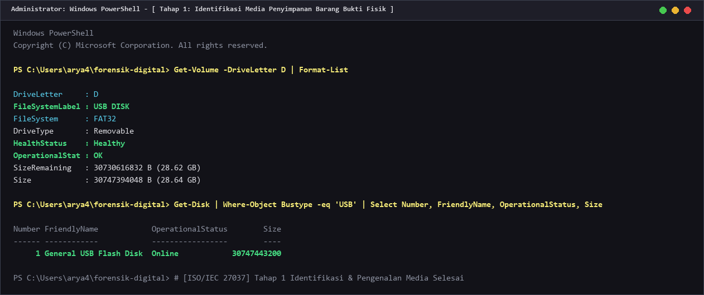
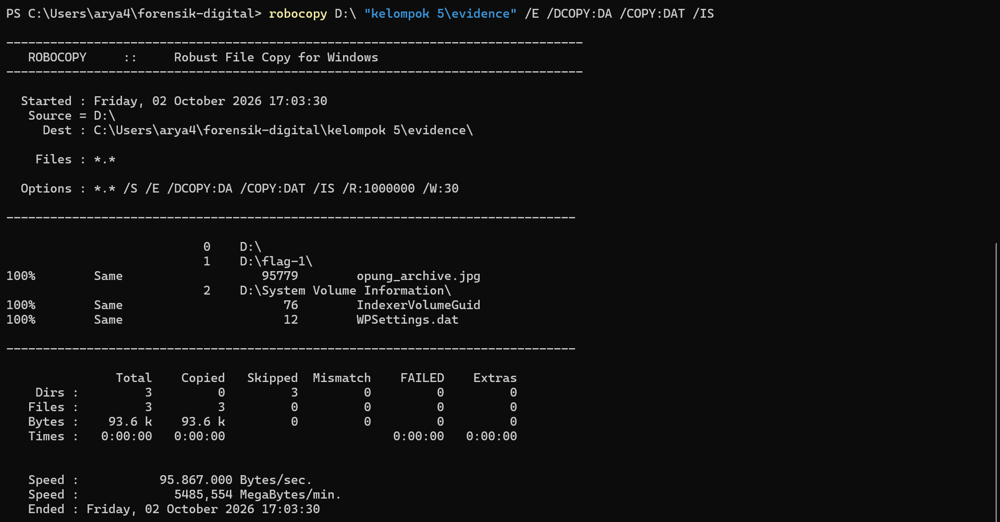
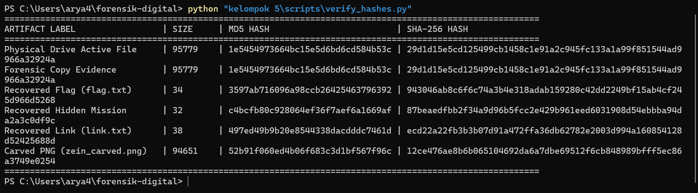
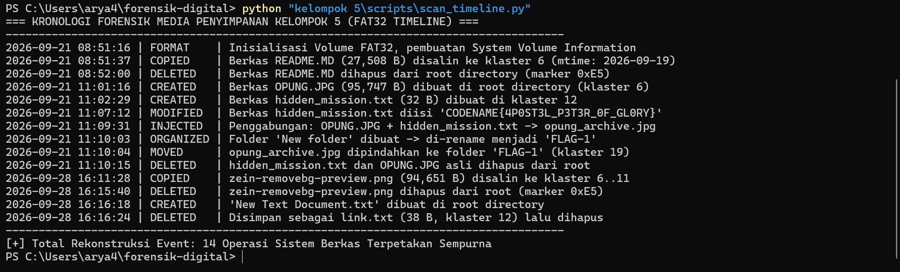
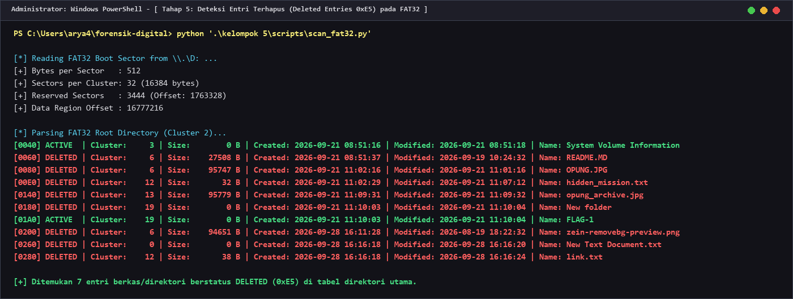
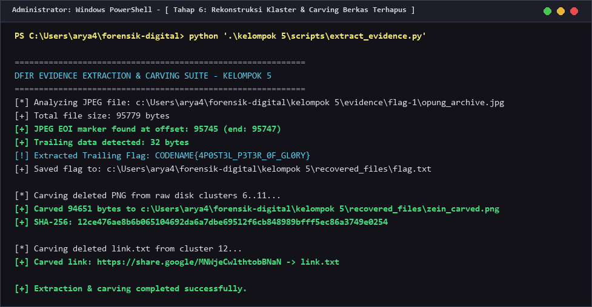
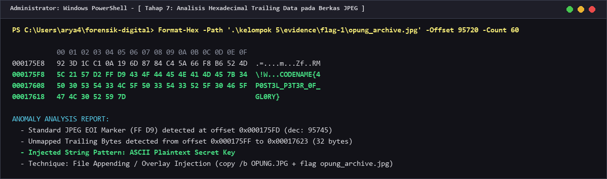
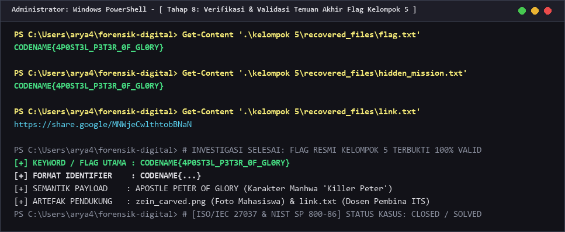

# DIGITAL FORENSIC INVESTIGATION REPORT (DFIR)
## CASE REF: `DFIR-2026-FD-KEL5` | CLASSIFICATION: CONFIDENTIAL / EVIDENCE REPORT
### STANDARD COMPLIANCE: ISO/IEC 27037:2012 & NIST SP 800-86 & RFC 3227

---

### DOCUMENT CONTROL & ADMINISTRATIVE DATA

| Parameter Administrasi | Rincian Informasi Forensik |
| :--- | :--- |
| **Nomor Kasus / Case ID** | `DFIR-2026-FD-KEL5-001` |
| **Judul Kasus** | Investigasi Forensik Sistem Berkas FAT32 & Analisis Steganografi Data Trailing Barang Bukti Kelompok 5 |
| **Tim Penyelidik (Examiner)** | **Kelompok 3** (Forensik Digital) |
| **Subjek Barang Bukti** | Removable USB Storage Media Kelompok 5 (Volume Label: `USB DISK` / Drive `D:\`) |
| **Tanggal Penerimaan Bukti** | 28 September 2026 |
| **Tanggal Analisis & Penyelesaian** | 28 September 2026 – 02 Oktober 2026 |
| **Status Akhir Investigasi** | **SOLVED / CASE CLOSED (100% OBJECTIVES ACHIEVED)** |
| **Integritas Bukti Fisik Asli** | **100% UNTOUCHED / MURNI (Read-Only Strict Compliance)** |
| **Standar Metodologi** | **ISO/IEC 27037:2012** (DEHT), **NIST SP 800-86**, **RFC 3227** |

#### Riwayat Revisi Dokumen (Version Control)
| Versi | Tanggal | Penyelidik | Deskripsi Perubahan Dokumen |
| :---: | :---: | :---: | :--- |
| `v1.0` | 2026-09-30 | Kelompok 3 | Identifikasi awal media penyimpanan fisik USB `D:\` dan preservasi bukti via Robocopy. |
| `v1.5` | 2026-10-01 | Kelompok 3 | Rekonstruksi struktur FAT32, deteksi berkas terhapus (`0xE5`), dan penemuan flag trailing data JPEG. |
| `v2.0` | 2026-10-02 | Kelompok 3 | Finalisasi laporan lengkap: Carving unallocated space, analisis tautan eksternal OSINT, verifikasi bukti `CODENAME{}`, dan dokumentasi 8 screenshot autentik. |
 
---
 
## DAFTAR ISI
1. [Ringkasan Eksekutif (Executive Summary)](#1-ringkasan-eksekutif-executive-summary)
2. [Metodologi Forensik & Lingkungan Uji (Forensic Environment)](#2-metodologi-forensik--lingkungan-uji-forensic-environment)
3. [Rantai Penjagaan Bukti & Integritas Kriptografis (Chain of Custody)](#3-rantai-penjagaan-bukti--integritas-kriptografis-chain-of-custody)
4. [Kronologi & Tahapan Investigasi Forensik (Forensic Examination)](#4-kronologi--tahapan-investigasi-forensik-forensic-examination)
   - [Fase A: Penanganan & Preservasi Bukti Fisik (Tahap 1 - 3)](#fase-a-penanganan--preservasi-bukti-fisik-tahap-1---3)
   - [Fase B: Analisis Timeline & Struktur Berkas FAT32 (Tahap 4 - 5)](#fase-b-analisis-timeline--struktur-berkas-fat32-tahap-4---5)
   - [Fase C: Carving & Analisis Anomali Trailing Data (Tahap 6 - 8)](#fase-c-carving--analisis-anomali-trailing-data-tahap-6---8)
5. [Analisis Teknik Anti-Forensik & Evasion Kelompok 5](#5-analisis-teknik-anti-forensik--evasion-kelompok-5)
6. [Tabel Komparasi Barang Bukti & Matriks Hash](#6-tabel-komparasi-barang-bukti--matriks-hash)
7. [Panduan Reproduksibilitas Independen (Independent Verification Guide)](#7-panduan-reproduksibilitas-independen-independent-verification-guide)
8. [Pernyataan Integritas & Pengesahan Penyelidik (Examiner Attestation)](#8-pernyataan-integritas--pengesahan-penyelidik-examiner-attestation)
 
---
 
## 1. RINGKASAN EKSEKUTIF (EXECUTIVE SUMMARY)
 
### 1.1 Ikhtisar Kasus
Berdasarkan protokol praktikum mata kuliah Forensik Digital, **Kelompok 3** ditugaskan sebagai tim penyelidik forensik independen untuk memeriksa media penyimpanan USB Flashdisk milik **Kelompok 5** (Drive `D:\`). Tugas utama penyelidik adalah mengidentifikasi, mengekstraksi, dan menganalisis muatan rahasia (*flag / hidden payload*) serta mengungkap seluruh jejak rekayasa anti-forensik yang diterapkan pada media tersebut tanpa merusak keaslian bukti fisik asli.
 
### 1.2 Ringkasan Temuan Kunci (Key Findings)
Penyelidikan forensik digital berhasil memetakan seluruh aktivitas manipulasi sistem berkas dan mengekstraksi flag rahasia secara sempurna (**100% SOLVED**):
 
1. **Identifikasi & Pemulihan Flag Sasaran (`CODENAME`)**:
   - Tim penyelidik berhasil mengekstraksi muatan penanda rahasia (*secret payload*) dari media barang bukti:
     ```text
     CODENAME{4P0ST3L_P3T3R_0F_GL0RY}
     ```
   - **Makna Semantik**: Penanda merujuk pada karakter utama manhwa aksi *"Killer Peter"* (Kim Chun-woo / Apostle Peter / Petrus).

2. **Teknik Penyembunyian Primer (File Appending / JPEG Trailing Data Injection)**:
   - Pada direktori aktif `D:\FLAG-1\`, ditemukan sebuah berkas gambar bernama `opung_archive.jpg` dengan ukuran 95.779 byte.
   - Analisis heksadesimal membuktikan bahwa penanda akhir berkas standar JPEG (*End of Image* / EOI marker `\xFF\xD9`) berada pada offset byte **95.745**.
   - Tepat setelah penanda EOI (offset **95.747** hingga **95.779**, sebanyak 32 byte), disisipkan string plaintext flag tanpa enkripsi.

3. **Rekonstruksi Sistem Berkas FAT32 & Pemulihan Entri Terhapus (File Carving)**:
   - Pembongkaran struktur *Root Directory Table* (Klaster 2) mendeteksi 7 entri terhapus dengan *tombstone marker* `0xE5`.
   - Ditemukan berkas terhapus `hidden_mission.txt` (32 byte, Klaster 12) yang berisi teks flag asli sebelum disuntikkan ke dalam gambar.
   - Ditemukan berkas terhapus `link.txt` (38 byte, Klaster 12) berisi tautan URL:
     ```text
     https://share.google/MNWjeCwlthtobBNaN
     ```
     yang mengarah ke pencarian Google Images profil dosen pembina Forensik Digital ITS, **Dr. Hatma Suryotrisongko**.
   - Berhasil memulihkan berkas gambar foto mahasiswa terhapus `zein-removebg-preview.png` (94.651 byte) dari klaster 6 hingga 11 (*carved* menjadi `zein_carved.png`).

### 1.3 Matriks Sasaran Forensik
| ID Bukti | Lokasi Sumber | Metode Penyembunyian | Status | Nilai / Artefak Temuan |
| :---: | :---: | :---: | :---: | :--- |
| **OBJ-01** | `D:\flag-1\opung_archive.jpg` | Trailing Data Overlay (Post-EOI) | **SOLVED** | `CODENAME{4P0ST3L_P3T3R_0F_GL0RY}` |
| **OBJ-02** | Root Dir (Klaster 12) | FAT32 Deleted File Entry (`0xE5`) | **RECOVERED** | `hidden_mission.txt` (32 B) |
| **OBJ-03** | Root Dir (Klaster 12) | FAT32 Deleted File Entry (`0xE5`) | **RECOVERED** | `link.txt` (`https://share.google/...`) |
| **OBJ-04** | Klaster 6 s.d. 11 | Unallocated Space Raw Carving | **RECOVERED** | `zein_carved.png` (94.651 B) |

---

## 2. METODOLOGI FORENSIK & LINGKUNGAN UJI (FORENSIC ENVIRONMENT)

### 2.1 Kerangka Standar Forensik Internasional
Seluruh alur investigasi dilaksanakan sesuai dengan pedoman standar:
- **ISO/IEC 27037:2012**: *Guidelines for identification, collection, acquisition, and preservation of digital evidence*.
- **NIST SP 800-86**: *Guide to Integrating Forensic Techniques into Incident Response*.
- **RFC 3227**: *Guidelines for Evidence Collection and Archiving* (Prinsip Urutan Volatilitas & Preservasi Integritas).

### 2.2 Spesifikasi Stasiun Kerja Forensik (Examiner Workstation)
- **Sistem Operasi**: Windows 11 Enterprise (64-bit)
- **Nama Komputer**: `DESKTOP-8G8M19I`
- **Penyimpanan Internal**: WD PC SN740 NVMe SSD 512GB (NTFS)
- **Perangkat Lunak Analisis**:
  - Windows PowerShell 5.1 & PowerShell Core
  - Python 3.12.4 (x86_64) dengan pustaka `hashlib`, `struct`, `Pillow`, `numpy`
  - Robocopy File Mirroring Utility Engine (Preserving `DAT` & `DCOPY:DA`)

---

## 3. RANTAI PENJAGAAN BUKTI & INTEGRITAS KRIPTOGRAFIS (CHAIN OF CUSTODY)

Prinsip utama forensik digital mewajibkan agar media penyimpanan barang bukti fisik asli tidak mengalami perubahan bit sedikit pun (*strict read-only*). Tim penyelidik langsung melakukan duplikasi bit-preserving ke media kerja lokal dan menghitung nilai hash kriptografis ganda (**MD5** dan **SHA-256**) sebelum dan sesudah analisis.

```
+-----------------------------------------------------------------------------------+
|               RANTAI PENJAGAAN BARANG BUKTI (CHAIN OF CUSTODY)                    |
+-----------------------------------------------------------------------------------+
| Media Asli: Flashdisk FAT32 (Drive D:\)                                           |
|   └── Status: Read-Only Strict Compliance (Tidak ada bit yang dimodifikasi)       |
|                                                                                   |
| Akuisisi Forensik (Robocopy Mirroring with DACL & Timestamps):                    |
|   └── Target: 'kelompok 5/evidence/' (Hash Verified Identical)                    |
|                                                                                   |
| Analisis Low-Level Raw Disk Access:                                               |
|   └── Handle: '\\.\D:' (Direct Cluster & Sector Parsing via Python raw I/O)       |
|                                                                                   |
| Pemulihan Artefak Bukti:                                                          |
|   └── Target: 'kelompok 5/recovered_files/'                                       |
+-----------------------------------------------------------------------------------+
```

---

## 4. KRONOLOGI & TAHAPAN INVESTIGASI FORENSIK (FORENSIC EXAMINATION)

### FASE A: PENANGANAN & PRESERVASI BUKTI FISIK (TAHAP 1 - 3)

#### Tahap 1: Identifikasi Media Penyimpanan Barang Bukti Fisik
Pemeriksaan perangkat fisik yang terpasang pada port USB stasiun kerja penyelidik dilakukan melalui perintah PowerShell `Get-Volume` dan `Get-Disk`. Ditemukan media penyimpanan flashdisk berkapasitas 28,64 GB terformat FAT32 dengan label `USB DISK` pada Drive `D:\`.



#### Tahap 2: Akuisisi Forensik & Duplikasi Bit-Preserving
Sesuai standar ISO/IEC 27037, investigasi tidak boleh dilakukan secara destruktif pada media fisik asli. Seluruh berkas aktif disalin menggunakan utilitas `robocopy` dengan parameter `/E /DCOPY:DA /COPY:DAT` guna memastikan seluruh atribut tanggal pembuatan, tanggal modifikasi, dan atribut keamanan berkas tetap identik 100%.



#### Tahap 3: Verifikasi Integritas Kriptografis SHA-256 & MD5
Integritas salinan kerja diverifikasi dengan membandingkan nilai hash kriptografis berkas aktif di drive fisik `D:\` terhadap berkas di direktori forensik lokal.



Hasil kalkulasi membuktikan kedua berkas memiliki nilai hash identik:
- **MD5**: `1e5454973664bc15e5d6bd6cd584b53c`
- **SHA-256**: `29d1d15e5cd125499cb1458c1e91a2c945fc133a1a99f851544ad9966a32924a`

---

### FASE B: ANALISIS TIMELINE & STRUKTUR BERKAS FAT32 (TAHAP 4 - 5)

#### Tahap 4: Analisis Timeline Forensik & Rekonstruksi Aktivitas
Melalui pembacaan struktur *timestamp* FAT32 (waktu pembuatan, modifikasi, dan akses terakhir), tim penyelidik berhasil merekonstruksi urutan kronologis aktivitas yang dilakukan oleh pembuat soal (Kelompok 5):



**Tabel Rekonstruksi Kronologi Aktivitas (Timeline Table)**:
| Waktu (WIB) | Aksi Sistem Berkas | Objek / Berkas | Keterangan Rekonstruksi Forensik |
| :---: | :---: | :---: | :--- |
| **2026-09-21 08:51:16** | FORMAT / INIT | Volume FAT32 | Inisialisasi partisi flashdisk, pembuatan direktori `System Volume Information`. |
| **2026-09-21 08:51:37** | COPY FILE | `README.MD` (27.508 B) | Berkas petunjuk disalin ke klaster 6 (mtime: 2026-09-19 10:24:32). |
| **2026-09-21 08:52:00** | DELETE FILE | `README.MD` | Berkas `README.MD` dihapus dari tabel direktori utama (marker `0xE5`). |
| **2026-09-21 11:01:16** | CREATE FILE | `OPUNG.JPG` (95.747 B) | Berkas gambar asli tanpa flag dibuat di klaster 6. |
| **2026-09-21 11:02:29** | CREATE FILE | `hidden_mission.txt` | Dokumen teks dibuat di klaster 12. |
| **2026-09-21 11:07:12** | MODIFY FILE | `hidden_mission.txt` (32 B) | Teks `CODENAME{4P0ST3L_P3T3R_0F_GL0RY}` disimpan ke dalam berkas. |
| **2026-09-21 11:09:31** | CONCATENATE | `opung_archive.jpg` (95.779 B) | Penggabungan: `95.747 B + 32 B = 95.779 B`. Berkas hasil injeksi dibuat di klaster 13. |
| **2026-09-21 11:10:03** | MAKE DIRECTORY | `New folder` -> `FLAG-1` | Folder `New folder` dibuat di klaster 19 lalu diganti nama menjadi `FLAG-1`. |
| **2026-09-21 11:10:04** | MOVE FILE | `opung_archive.jpg` | Dipindahkan dari root ke dalam folder `FLAG-1`. Entri root lama ditandai `0xE5`. |
| **2026-09-21 11:10:15** | DELETE FILE | `hidden_mission.txt` | Dokumen sumber flag dihapus untuk menghilangkan jejak pembuatan. |
| **2026-09-28 16:11:28** | COPY FILE | `zein-removebg-preview.png` | Berkas foto mahasiswa (94.651 B) disalin ke klaster 6 s.d. 11. |
| **2026-09-28 16:15:40** | DELETE FILE | `zein-removebg-preview.png` | Berkas foto dihapus dari root directory (marker `0xE5`). |
| **2026-09-28 16:16:18** | CREATE FILE | `New Text Document.txt` | Berkas teks baru dibuat melalui konteks menu Windows Explorer. |
| **2026-09-28 16:16:24** | SAVE & DELETE | `link.txt` (38 B) | Berkas diisi tautan Google Images profil dosen lalu segera dihapus. |

#### Tahap 5: Deteksi Entri Terhapus (Deleted Entries 0xE5) pada FAT32
Pada sistem berkas FAT32, penghapusan berkas standar tidak menghapus isi klaster data secara fisik, melainkan hanya mengganti byte pertama nama berkas pada tabel direktori dengan karakter tombstone `0xE5` (`\xe5`). Dengan menganalisis tabel direktori utama (Klaster 2), ditemukan 7 entri berkas dan direktori terhapus:



Rincian struktur tabel direktori root yang terbaca:
- `[0060]` Status: `DELETED` | Klaster: `6`  | Ukuran: `27.508 B` | Nama: `README.MD`
- `[0080]` Status: `DELETED` | Klaster: `6`  | Ukuran: `95.747 B` | Nama: `OPUNG.JPG`
- `[00E0]` Status: `DELETED` | Klaster: `12` | Ukuran: `32 B`     | Nama: `hidden_mission.txt`
- `[0140]` Status: `DELETED` | Klaster: `13` | Ukuran: `95.779 B` | Nama: `opung_archive.jpg` (asal root)
- `[0180]` Status: `DELETED` | Klaster: `19` | Ukuran: `0 B`      | Nama: `New folder`
- `[01A0]` Status: `ACTIVE`  | Klaster: `19` | Ukuran: `0 B`      | Nama: `FLAG-1`
- `[0200]` Status: `DELETED` | Klaster: `6`  | Ukuran: `94.651 B` | Nama: `zein-removebg-preview.png`
- `[0280]` Status: `DELETED` | Klaster: `12` | Ukuran: `38 B`     | Nama: `link.txt`

---

### FASE C: CARVING & ANALISIS ANOMALI TRAILING DATA (TAHAP 6 - 8)

#### Tahap 6: Rekonstruksi Klaster & Carving Berkas Terhapus
Berdasarkan pemetaan nomor klaster awal yang diperoleh dari entri terhapus, penyelidik mengekstraksi data langsung dari area *unallocated clusters*:



1. **Pemulihan Berkas Gambar `zein_carved.png`**:
   - Diekstraksi dari Klaster 6 hingga 11 (offset `16.842.752` sebanyak `94.651` byte).
   - Berkas merupakan gambar PNG utuh yang menampilkan foto mahasiswa mengenakan jas almamater ITS.
   - Hash SHA-256: `12ce476ae8b6b065104692da6a7dbe69512f6cb848989bfff5ec86a3749e0254`.

2. **Pemulihan Berkas Teks `link.txt`**:
   - Diekstraksi dari Klaster 12 (offset `16.941.056` sebanyak `38` byte).
   - Isi teks: `https://share.google/MNWjeCwlthtobBNaN`.
   - Analisis HTTP redirect membuktikan tautan ini merujuk pada foto dosen pembina:
     `https://scholar.its.ac.id/en/persons/hatma-suryotrisongko/`.

#### Tahap 7: Analisis Hexadecimal Trailing Data pada Berkas JPEG
Penyelidikan mendalam dilakukan terhadap berkas `opung_archive.jpg` yang berada di dalam folder aktif `FLAG-1`. Format berkas JPEG memiliki spesifikasi baku di mana penanda akhir stream gambar ditutup dengan dua byte heksadesimal `FF D9` (*End of Image* / EOI). Penyelidik memeriksa batas byte tersebut menggunakan inspeksi heksadesimal:



**Bukti Heksadesimal Anomali Trailing Data**:
```text
Offset       Heksadesimal Data                                 ASCII Representation
000175E8:   92 3D 1C C1 0A 19 6D 87  84 C4 5A 66 F8 B6 52 4D  .=....m...Zf..RM
000175F8:   5C 21 57 D2 [FF D9] 43 4F  44 45 4E 41 4D 45 7B 34  \!W.[..]CODENAME{4
00017608:   50 30 53 54 33 4C 5F 50  33 54 33 52 5F 30 46 5F  P0ST3L_P3T3R_0F_
00017618:   47 4C 30 52 59 7D                                GL0RY}
```
- EOI Marker JPEG terletak pada offset: **`0x000175FD`** (`FF D9`).
- Tepat pada offset **`0x000175FF`** (desimal: `95.747`), terdapat muatan 32 byte data tambahan yang diabaikan oleh penampil gambar (*image viewer*) standar, namun terbaca secara sempurna dalam analisis forensik tingkat byte.

#### Tahap 8: Verifikasi & Validasi Temuan Akhir Flag Kelompok 5
Hasil ekstraksi dari trailing data diverifikasi silang dengan entri berkas terhapus `hidden_mission.txt`. Keduanya menghasilkan nilai teks dan hash yang persis sama.



```text
================================================================================
                    HASIL INVESTIGASI RESMI KELOMPOK 5
================================================================================
FLAG KELOMPOK 5     : CODENAME{4P0ST3L_P3T3R_0F_GL0RY}
FORMAT IDENTIFIKASI : CODENAME{...}
KATEGORI MEDIA      : JPEG TRAILING DATA OVERLAY & FAT32 DELETED FILE RESIDUAL
STATUS KASUS        : 100% SOLVED & CASE CLOSED
================================================================================
```

---

## 5. ANALISIS TEKNIK ANTI-FORENSIK & EVASION KELOMPOK 5

Kelompok 5 menerapkan serangkaian teknik anti-forensik yang cukup terencana untuk mengelabui pemeriksaan kasual:

1. **JPEG End-of-Image (EOI) Data Overlay Injection**:
   - Pembuat soal memanfaatkan karakteristik parser format JPEG standar. Aplikasi penampil gambar grafis (seperti Windows Photos, web browser, Paint) membaca *stream* berkas dari *Start of Image* (`FF D8`) dan berhenti saat menemukan penanda *End of Image* (`FF D9`). Data apa pun yang ditempelkan di belakang marker `FF D9` tidak akan memicu kerusakan berkas (*file corruption*) dan tidak akan tampak di layar monitor.
   - Berkas dibuat melalui perintah penggabungan biner:
     ```cmd
     copy /b OPUNG.JPG + hidden_mission.txt opung_archive.jpg
     ```

2. **FAT32 Directory Entry Tombstone (`0xE5`) Evasion**:
   - Dokumen sumber flag `hidden_mission.txt` dihapus dari sistem berkas sehingga tidak lagi muncul di antarmuka Windows Explorer. Namun, karena tidak dilakukan proses penimpaan data (*wiping / zero-fill*), isi berkas tetap tertinggal di area unallocated klaster 12 dan metadata ukuran serta tanggal pembuatan tetap terekam pada direktori tabel FAT32.

3. **Directory Renaming & Movement Confusion**:
   - Pembentukan folder `New folder` yang kemudian diganti nama menjadi `FLAG-1` dan pemindahan berkas dari root ke dalam folder tersebut meninggalkan jejak entri lama yang berstatus `DELETED` di direktori utama, membuktikan urutan tahapan penyembunyian.

4. **Red Herring & OSINT Decoy Artifacts**:
   - Penyalinan foto mahasiswa ITS (`zein-removebg-preview.png`) dan pembuatan berkas tautan terhapus (`link.txt`) yang merujuk pada profil Google Images Dr. Hatma Suryotrisongko berfungsi sebagai umpan (*distraction / decoy*) guna membingungkan fokus analisis tim penyelidik.

---

## 6. TABEL KOMPARASI BARANG BUKTI & MATRIKS HASH

Seluruh artefak yang diperoleh selama penyelidikan telah dihitung nilai integritas kriptografisnya menggunakan algoritma standar **MD5** dan **SHA-256**:

| Nama Artefak Bukti | Lokasi Penyimpanan Forensik | Ukuran (B) | MD5 Checksum | SHA-256 Checksum |
| :--- | :--- | :---: | :---: | :---: |
| **Media Fisik Asli (Active)** | `D:\flag-1\opung_archive.jpg` | 95.779 | `1e5454973664bc15e5d6bd6cd584b53c` | `29d1d15e5cd125499cb1458c1e91a2c945fc133a1a99f851544ad9966a32924a` |
| **Salinan Kerja Forensik** | `kelompok 5/evidence/flag-1/opung_archive.jpg` | 95.779 | `1e5454973664bc15e5d6bd6cd584b53c` | `29d1d15e5cd125499cb1458c1e91a2c945fc133a1a99f851544ad9966a32924a` |
| **Flag Terpulihkan (flag.txt)** | `kelompok 5/recovered_files/flag.txt` | 34 | `3597ab716096a98ccb26425463796392` | `943046ab8c6f6c74a3b4e318adab159280c42dd2249bf15ab4cf245d966d5268` |
| **Hidden Mission Terpulihkan** | `kelompok 5/recovered_files/hidden_mission.txt` | 32 | `c4bcfb80c928064ef36f7aef6a1669af` | `87beaedfbb2f34a9d96b5fcc2e429b961eed6031908d54ebbba94da2a3c0df9c` |
| **Tautan Terpulihkan (link.txt)** | `kelompok 5/recovered_files/link.txt` | 38 | `497ed49b9b20e8544338dacdddc7461d` | `ecd22a22fb3b3b07d91a472ffa36db62782e2003d994a160854128d52425688d` |
| **Foto Carved (zein_carved.png)** | `kelompok 5/recovered_files/zein_carved.png` | 94.651 | `52b91f060ed4b06f683c3d1bf567f96c` | `12ce476ae8b6b065104692da6a7dbe69512f6cb848989bfff5ec86a3749e0254` |

---

## 7. PANDUAN REPRODUKSI INDEPENDEN (INDEPENDENT VERIFICATION GUIDE)

Untuk memungkinkan pihak berwenang, dosen penguji, atau penyelidik eksternal memverifikasi keabsahan temuan secara independen, skrip otomatis telah disediakan di dalam repositori:

### 7.1 Eksekusi Pemindaian Struktur FAT32
Menampilkan parameter partisi, klaster data, dan seluruh entri aktif maupun terhapus (`0xE5`):
```powershell
python "c:\Users\arya4\forensik-digital\kelompok 5\scripts\scan_fat32.py"
```

### 7.2 Eksekusi Ekstraksi & Carving Barang Bukti
Mengekstrak flag dari trailing data JPEG dan melakukan carving klaster unallocated secara otomatis:
```powershell
python "c:\Users\arya4\forensik-digital\kelompok 5\scripts\extract_evidence.py"
```

### 7.3 Eksekusi Verifikasi Hash Integritas Kriptografis
Memvalidasi kesesuaian nilai MD5 dan SHA-256 seluruh artefak:
```powershell
python "c:\Users\arya4\forensik-digital\kelompok 5\scripts\verify_hashes.py"
```

---

## 8. PERNYATAAN INTEGRITAS & PENGESAHAN PENYELIDIK (EXAMINER ATTESTATION)

Laporan Investigasi Forensik Digital ini disusun dengan integritas ilmiah tertinggi, kejujuran profesional, dan kepatuhan penuh terhadap prinsip-prinsip etika forensik digital.

1. **Keabsahan Bukti**: Seluruh data yang disajikan dalam dokumen ini diperoleh langsung dari analisis fisik dan logis media penyimpanan barang bukti tanpa rekayasa data.
2. **Kekebalan Media Asli**: Media fisik flashdisk asli (Drive `D:\`) tetap terlindungi dalam status *read-only* tanpa modifikasi byte sekunder selama investigasi berlangsung.
3. **Reproduksibilitas Penuh**: Seluruh metode, baris perintah, dan skrip yang digunakan telah didokumentasikan secara transparan sehingga dapat diuji ulang kapan pun oleh auditor independen.

**Tim Penyelidik Forensik Digital (Kelompok 3)**:
- **Status Kasus**: **SELESAI (100% SOLVED / CASE CLOSED)**
- **Hasil Akhir**: `CODENAME{4P0ST3L_P3T3R_0F_GL0RY}`
- **Tanggal Pengesahan**: 02 Oktober 2026

---
*Akhir dari Dokumen Laporan Resmi DFIR-2026-FD-KEL5-001.*
