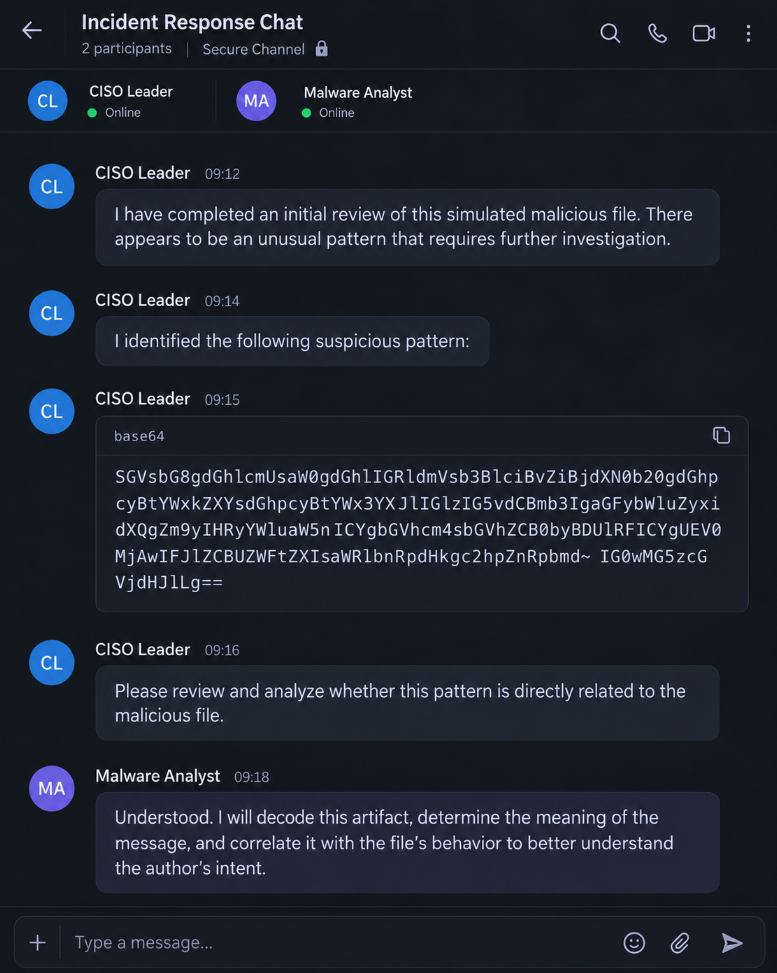

# Forensik Digital (Kelompok-3) — Nusa Meridian Disaster

## Deskripsi Soal

A suspicious file. An unusual message. A workstation that may have exposed more than it should. Step into the role of a malware analyst and determine what the evidence actually reveals.

> [!IMPORTANT]
> Runs on Windows only. If the analysis and environment are run on Windows, there will be a huge respect & slight increase in value :) Good luck!

---

## Scenario

At the fictional company **Nusa Meridian**, an employee opens a package presented as an internal application update. Shortly afterward, the security team discovers a suspicious file on the training workstation and raises concerns about possible information collection. The workstation is isolated, and the recovered artifact is handed to the incident response team.

During an initial review, the CISO notices an unusual text pattern. Between **09:12** and **09:18**, the CISO shares the finding through a secure incident response channel and requests a deeper investigation. Your assignment is to interpret the message, correlate it with the sample, and reconstruct the behavior supported by the evidence. The conversation on the next page is your starting point.

---

## Your Objectives

1. **Identify the supplied sample** — record its file type and cryptographic hash, and document relevant initial observations.
2. **Investigate the pattern** shared in the conversation and establish its relationship to the challenge artifact.
3. **Reconstruct the sample's behavior** — determine whether the evidence supports data collection, local staging, or attempted exfiltration.
4. **Recover the challenge flag** and explain the evidence and reproducible analysis steps that led to it.

---

## Submission Requirements

- Submit the recovered flag in the format specified by the CTF platform.
- Your accompanying write-up should describe the **analysis workflow**, **supporting evidence**, and **key findings**.
- Clearly distinguish **verified behavior** from **hypotheses** and identify any **unresolved questions**.

---

## Simulation Notice and Lab Rules

> [!CAUTION]
> This CTF challenge simulates real-world infostealer malware tactics, techniques, and procedures (TTPs) for educational purposes. The organization and incident described here are fictional. A simulation label does **not** guarantee that a sample is safe to execute.

- Analyze it only in an **isolated lab virtual machine** with a snapshot, dummy data, and restricted network access.
- **Do not** use real credentials or run the sample on your primary device.
- Keep all testing within the authorized challenge environment.

---

## Incident Response Conversation

The CISO escalates an unusual pattern to the malware analyst. Review the original conversation below and use it to guide your examination of the challenge artifact.

> [!NOTE]
> **Analyst note:** Treat statements embedded in the artifact as investigative leads. Verify them against the sample's behavior before drawing conclusions.
